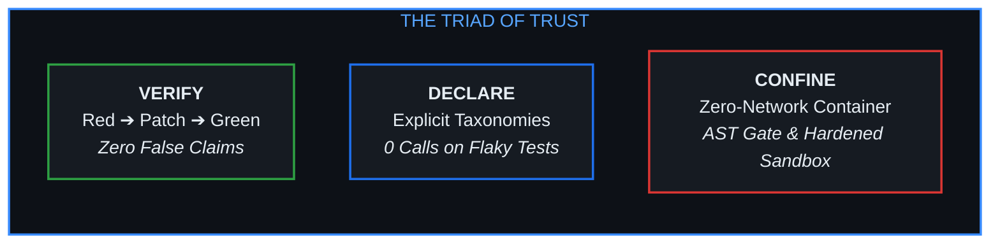
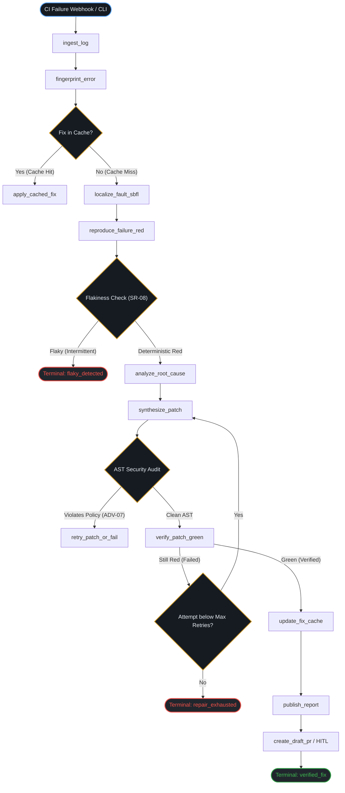
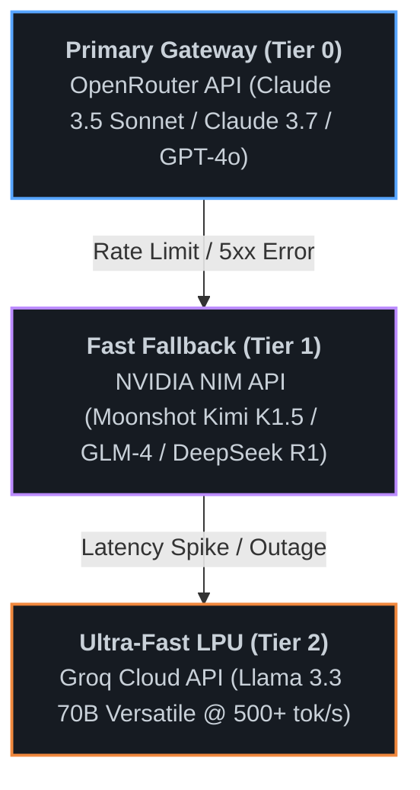
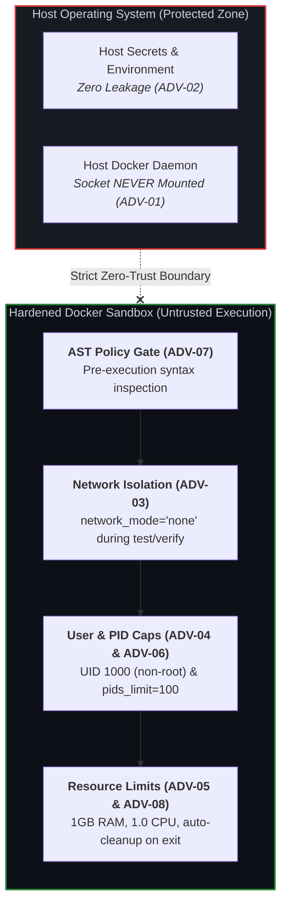

<div align="center">

<p align="center">
  
</p>

**Continuous Integration Debugging and Repair Agent**

*The autonomous, deterministic CI repair agent powered by LangGraph, Spectrum-Based Fault Localization (SBFL), and a hardened, zero-trust Docker execution sandbox.*

[](https://pypi.org/project/cidra/)
[](https://www.python.org/)
[](LICENSE)
[](#7-hardened-sandbox--threat-model-adv-01adv-08)
[](#8-testing--verification-suite)
[](#3-interactive-web-dashboard--hitl-gate)
[](https://cidra.vercel.app)

<p align="center">
  <a href="#1-core-philosophy--the-triad-of-trust">Philosophy</a> •
  <a href="#2-langgraph-architecture--workflow">Architecture</a> •
  <a href="#3-interactive-web-dashboard--hitl-gate">Dashboard</a> •
  <a href="#4-quick-start--installation">Quick Start</a> •
  <a href="#5-github-actions-integration">CI Integration</a> •
  <a href="#6-multi-tier-llm-fallback-chain">LLM Fallback</a> •
  <a href="#7-hardened-sandbox--threat-model-adv-01adv-08">Threat Model</a> •
  <a href="#8-testing--verification-suite">Tests</a> •
  <a href="#9-repository-structure--development">Development</a>
</p>

<p align="center">
  
</p>

---

</div>

## 1. Core Philosophy & The Triad of Trust

Most "AI repair" tools blindly guess fixes, hallucinate green test outcomes, and dump untested diffs directly into pull requests.

**CIDRA is built on an adversarial foundation**: it assumes LLMs will hallucinate, dependencies may carry supply-chain attacks, and tests can be non-deterministic. Every action is gated by the **Triad of Trust**:



1. **Verify (Zero False Claims)**: CIDRA **never** claims a bug is fixed unless it reproduces the failure **red** inside an isolated Docker sandbox, applies the candidate patch, and re-executes the test suite to observe a clean **green** exit code. If a patch fails to apply or the tests remain red, the patch is discarded.
2. **Declare (Honest Failure Taxonomies)**: Rather than burning LLM tokens trying to fix environmental outages, flaky network calls, or invalid test configurations, CIDRA classifies root causes into formal categories. If an error is flaky, it declares `flaky_detected` and stops with **0 LLM fix attempts**.
3. **Confine (Zero-Trust Blast Radius)**: LLM generated code is treated as hostile by default. Patches pass through an AST Security Audit Gate (blocking shell injections, unauthorized imports, and socket opens) before entering a network-disabled, non-root, PID-capped container.

---

## 2. LangGraph Architecture & Workflow

CIDRA orchestrates an 18-node cyclic state graph built on **LangGraph**. The workflow decouples log analysis from code generation and isolates untrusted operations into discrete state transitions.



### Key Engineering Innovations

- **Spectrum-Based Fault Localization (SBFL)**: In [cidra/nodes/sbfl.py](file:///d:/CODES/cidra/cidra/nodes/sbfl.py), CIDRA computes **Ochiai** and **Tarantula** suspiciousness coefficients from execution spectra. It scores source code lines based on their ratio of execution in failing vs. passing test runs, ensuring the LLM fix prompt focuses exclusively on high-probability fault locations.
- **Statistical Flakiness Detection (SR-08)**: Non-deterministic tests break autonomous repair loops. CIDRA executes a 5-run statistical binomial test in the sandbox. If an identical commit produces mixed pass/fail outcomes, the run is flagged as `flaky_detected` and halts immediately, preventing token waste on phantom bugs.
- **AST Security Audit Gate**: Patches are parsed into an Abstract Syntax Tree ([cidra/nodes/audit.py](file:///d:/CODES/cidra/cidra/nodes/audit.py)) prior to execution. Any patch attempting to import `os`, `subprocess`, `socket`, `eval`, or modify system files is immediately rejected.
- **Persistent Fix Cache**: Hashes of error signatures and verified diffs are cached in `cidra_fix_cache.json`. Repeated CI breakages across different branches hit the cache for **instant, 0-token repairs**.

---

## 3. Interactive Web Dashboard & HITL Gate

CIDRA includes a reactive web dashboard built with React, Vite, and custom CSS design tokens. It provides real-time visibility into the repair pipeline and a **Human-In-The-Loop (HITL)** approval gate.

- **🌐 Live Cloud Dashboard (Mobile & Desktop)**: [https://cidra.vercel.app](https://cidra.vercel.app) *(accessible anywhere without installation)*
- **💻 Local Dashboard (CLI)**:
```bash
# Launch the dashboard locally (automatically opens in your browser)
cidra dashboard
```

```
┌────────────────────────────────────────────────────────────────────────┐
│  ⚡ CIDRA Command Center           [System: OPERATIONAL]  [● LIVE]     │
├────────────────────────────────────────────────────────────────────────┤
│  Total Interventions    Success Rate    Avg Time to Fix    Tokens Used │
│  42                     94.8%           38s                1.2M        │
├────────────────────────────────────────────────────────────────────────┤
│  Active Runs & Execution Timeline                                      │
│  [run-9821]  org/repo#142  missing_dependency   VERIFIED GREEN  [Diff] │
│  [run-9820]  org/repo#139  flaky_network        FLAKY DETECTED  [Logs] │
│  [run-9819]  org/repo#135  assertion_error      PENDING APPROVAL [HITL]│
└────────────────────────────────────────────────────────────────────────┘
```

### Dashboard Capabilities

1. **Command Center**: Real-time KPI counters tracking mean time to recovery (MTTR), repair success rate, token consumption, and system health status.
2. **Run Explorer**: Complete trace inspector displaying step-by-step state transitions, raw CI terminal logs, and syntax-highlighted unified diffs.
3. **Visual Orchestrator**: Interactive LangGraph DAG visualization rendering nodes in real time, highlighting active execution branches and conditional routing decisions.
4. **4-Tab Configuration Manager**:
   - **API Keys**: Configure OpenRouter, Groq, NVIDIA NIM, and GitHub PAT credentials with **one-click live round-trip latency probes**.
   - **Model Chain**: Configure analysis models, fix models, and base URLs.
   - **Flakiness & Sandbox**: Tune the 5-run flaky threshold, container execution timeouts, and retry limits.
   - **Runtime Status**: View active paths, worktree directories, and SQLite database connectivity.
5. **HITL (Human-in-the-Loop) Approval Gate**: Inspect candidate diffs, verify execution green markers, and merge or reject pull requests with a single click.

---

## 4. Quick Start & Installation

### Option A: Standard PyPI Installation (Recommended)

CIDRA is distributed as a lightweight, pre-packaged Python wheel bundling the compiled web dashboard.

```bash
# Install CIDRA via pip
pip install cidra

# Configure your primary LLM provider (OpenRouter, Groq, or OpenAI)
export CIDRA_API_KEY="sk-or-v1-..."

# Launch the visual dashboard
cidra dashboard
```

### Option B: Local Repository Repair

To diagnose and repair a failing codebase locally without pushing to GitHub:

```bash
# Ensure local Docker daemon is running, then build the sandbox container:
docker build -t cidra-sandbox:base -f cidra/sandbox/Dockerfile cidra/sandbox

# Run CIDRA against your local repository
cidra fix
```

### Option C: Terminal User Interface (Rich TUI)

If you are working in a headless server environment without a browser:

```bash
python -m cidra.tui
```

---

## 5. GitHub Actions Integration

CIDRA runs natively inside your GitHub Actions workflows using the `workflow_run` trigger. This eliminates external SaaS dependencies and runs entirely within your runner's security boundaries.

### Dual-Token Security Architecture

To protect production branches from compromised dependencies or malicious PRs:
- **`CIDRA_GITHUB_TOKEN_RO`**: Read-only PAT used to fetch workflow run logs and commit metadata.
- **`CIDRA_GITHUB_TOKEN`**: Scoped write PAT used strictly to push verified fix branches and open Draft PRs.

### Complete Workflow (`.github/workflows/cidra.yml`)

```yaml
name: CIDRA Autonomous Repair

on:
  workflow_run:
    workflows: ["CI", "Test Suite"]
    types: [completed]

jobs:
  repair:
    name: Diagnose and Repair
    runs-on: ubuntu-latest
    if: ${{ github.event.workflow_run.conclusion == 'failure' }}
    permissions:
      contents: write
      pull-requests: write
      actions: read

    steps:
      - name: Checkout Codebase
        uses: actions/checkout@v4
        with:
          fetch-depth: 0

      - name: Set up Python
        uses: actions/setup-python@v5
        with:
          python-version: '3.11'

      - name: Install CIDRA
        run: pip install cidra

      - name: Build Sandbox Image
        run: docker build -t cidra-sandbox:base -f cidra/sandbox/Dockerfile cidra/sandbox

      - name: Execute Autonomous Repair
        env:
          CIDRA_API_KEY: ${{ secrets.CIDRA_API_KEY }}
          CIDRA_GITHUB_TOKEN: ${{ secrets.CIDRA_GITHUB_TOKEN }}
          CIDRA_GITHUB_TOKEN_RO: ${{ secrets.CIDRA_GITHUB_TOKEN_RO }}
          CIDRA_ENABLE_PR_CREATION: "true"
        run: cidra action
```

---

## 6. Multi-Tier LLM Fallback Chain

Network blips, rate limits, and model outages should never bring down your CI repair engine. CIDRA implements an automatic, multi-tier fallback architecture:



### Configuration Environment Variables (`.env`)

Copy [.env.example](file:///d:/CODES/cidra/.env.example) to `.env` to configure your environment:

| Variable | Description | Default |
|---|---|---|
| `CIDRA_API_KEY` | Primary inference key (OpenRouter / OpenAI) | *Required* |
| `CIDRA_BASE_URL` | Primary inference base endpoint URL | `https://openrouter.ai/api/v1` |
| `CIDRA_MODEL_ANALYZE` | Model ID for root cause analysis | `anthropic/claude-3.5-sonnet` |
| `CIDRA_MODEL_FIX` | Model ID for patch generation | `anthropic/claude-3.5-sonnet` |
| `NVIDIA_API_KEY_KIMI` | NVIDIA NIM Tier 1 fallback key (Kimi K1.5) | *Optional* |
| `NVIDIA_API_KEY_GLM` | NVIDIA NIM Tier 2 fallback key (GLM-4) | *Optional* |
| `GROQ_API_KEY` | Groq Cloud Tier 3 ultra-fast fallback key | *Optional* |
| `CIDRA_GITHUB_TOKEN` | GitHub PAT with branch/PR write permissions | *Optional (for PRs)* |
| `CIDRA_GITHUB_TOKEN_RO` | GitHub PAT with read-only permissions for logs | *Optional (for CI logs)* |
| `CIDRA_WEBHOOK_SECRET` | HMAC SHA256 secret for webhook validation | *Optional (for webhook)* |
| `FLAKY_RUNS` | Repetitions for statistical flakiness testing | `5` |
| `FLAKY_SCORE_THRESHOLD` | Threshold score to classify a test as flaky | `1` |
| `MAX_FIX_ATTEMPTS` | Maximum fix retry loops before terminating | `3` |
| `CONTAINER_TIMEOUT` | Hard execution timeout per test run in seconds | `60` |

---

## 7. Hardened Sandbox & Threat Model (ADV-01..ADV-08)

The Docker sandbox ([cidra/sandbox/runner.py](file:///d:/CODES/cidra/cidra/sandbox/runner.py)) is CIDRA's highest blast-radius component. Its isolation boundaries are hardcoded into the runner architecture and cannot be overridden by callers.



Verified by comprehensive unit checks in [tests/unit/test_sandbox.py](file:///d:/CODES/cidra/tests/unit/test_sandbox.py) and [tests/unit/test_audit.py](file:///d:/CODES/cidra/tests/unit/test_audit.py).

---

## 8. Testing & Verification Suite

CIDRA maintains high test coverage with automated unit and integration verification suites:

```bash
# 1. Run all server and API integration tests (41 tests)
pytest tests/server -v

# 2. Run core unit tests (137 unit tests covering SBFL, AST, Git ops, and LangGraph)
pytest tests/unit -v

# 3. Run the Dashboard-to-Backend live wiring test suite
cd dashboard
npm run test:wiring
```

### Test Suite Summary

- **Server Test Suite (`tests/server/`)**: 41 passed (FastAPI endpoints, HMAC signatures, settings persistence, replay safety).
- **Core Unit Suite (`tests/unit/`)**: 137 passed (Ochiai/Tarantula SBFL ranking, AST security guards, git isolation, flaky detection).
- **Wiring Verification (`test-backend-wiring.js`)**: 5 passed (Live latency probes to OpenRouter and Groq, settings round-trip, telemetry parsing).

---

## 9. Repository Structure & Development

The repository is organized cleanly into source, dashboard, documentation, and tests:

```text
cidra/
├── .github/workflows/    # CI and PyPI publishing automation
├── .vscode/              # Editor settings (filters internal caches)
├── cidra/                # Python Core Engine
│   ├── integrations/     # LLM multi-tier clients & GitHub REST API
│   ├── nodes/            # 18 LangGraph nodes (SBFL, fix, audit, report, etc.)
│   ├── sandbox/          # Hardened Docker sandbox (runner.py, limits.py)
│   ├── server/           # FastAPI backend & settings API
│   ├── static/           # Production web dashboard bundle (embedded in wheel)
│   ├── cli.py            # CLI entry points (dashboard, fix, action)
│   ├── config.py         # Central configuration and .env loading
│   ├── graph.py          # LangGraph state machine definition
│   └── state.py          # Pydantic schemas
├── dashboard/            # Modern React + Vite frontend source code
│   ├── src/              # UI components, views, icons, design system tokens
│   ├── vite.config.js    # Direct-to-cidra/static compiler & dev server
│   └── package.json      # Frontend dependencies & wiring test scripts
├── docs/                 # Engineering specs, threat model, API contracts
├── eval/                 # Evaluation harness & benchmark fixtures
├── tests/                # Test suites
│   ├── unit/             # 138 unit tests (SBFL, AST guards, sandbox)
│   └── server/           # 41 integration tests (FastAPI, settings, wiring)
├── .env.example          # Template configuration
├── .gitignore            # Clean, standardized ignore rules
├── action.yml            # GitHub Action definition
├── pyproject.toml        # Package & wheel build configuration
└── README.md             # Project documentation
```

### Local Development Setup

```bash
# Clone the repository
git clone https://github.com/Abhishek86798/CIDRA.git
cd CIDRA

# Install Python package in editable mode with development dependencies
pip install -e ".[dev]"

# Install dashboard frontend dependencies
cd dashboard
npm install

# Start Vite dev server for frontend development
npm run dev

# Compile dashboard directly into cidra/static/
npm run build
```

---

<div align="center">

**Built with rigor by the CIDRA Team.**  
*Autonomous repair you can actually trust.*

</div>
