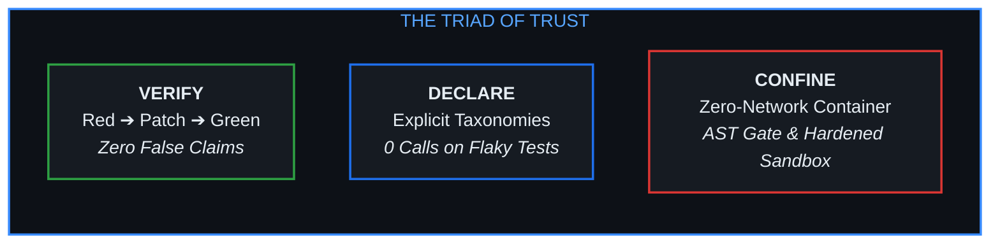
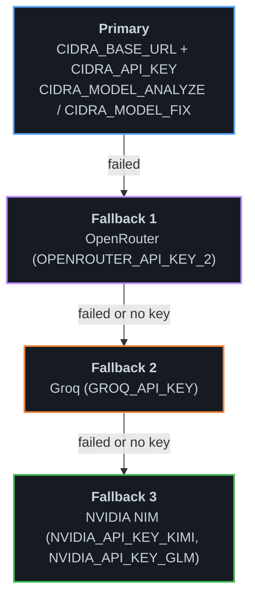
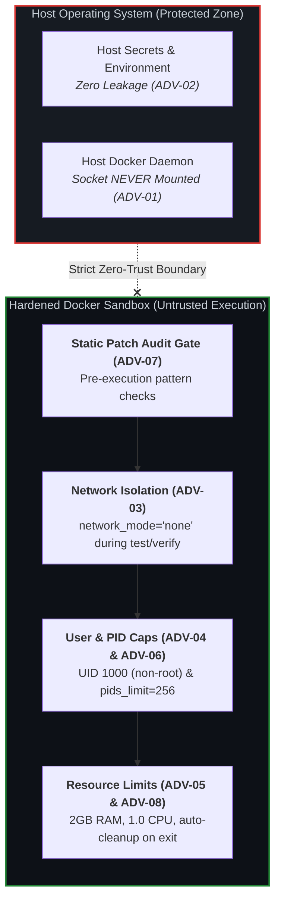

<div align="center">

<p align="center">
  
</p>

**Continuous Integration Debugging and Repair Agent**

*The autonomous, deterministic CI repair agent powered by LangGraph, Spectrum-Based Fault Localization (SBFL), and a hardened, zero-trust Docker execution sandbox.*

[](https://pypi.org/project/cidra/)
[](https://www.python.org/)
[](LICENSE)
[](#7-hardened-sandbox--threat-model-adv-01adv-08)
[](https://github.com/abhishekKokadwar/CIDRA/actions/workflows/test-cidra.yml)
[](#3-interactive-web-dashboard--hitl-gate)
[](https://cidra.vercel.app)

<p align="center">
  <a href="#1-core-philosophy--the-triad-of-trust">Philosophy</a> •
  <a href="#2-langgraph-architecture--workflow">Architecture</a> •
  <a href="#3-interactive-web-dashboard--hitl-gate">Dashboard</a> •
  <a href="#4-quick-start--installation">Quick Start</a> •
  <a href="#5-github-actions-integration">CI Integration</a> •
  <a href="#6-multi-tier-llm-fallback-chain">LLM Fallback</a> •
  <a href="#7-hardened-sandbox--threat-model-adv-01adv-08">Threat Model</a> •
  <a href="#8-testing--verification-suite">Tests</a> •
  <a href="#9-repository-structure--development">Development</a>
</p>

<p align="center">
  
</p>

---

</div>

## 1. Core Philosophy & The Triad of Trust

Most "AI repair" tools blindly guess fixes, hallucinate green test outcomes, and dump untested diffs directly into pull requests.

**CIDRA is built on an adversarial foundation**: it assumes LLMs will hallucinate, dependencies may carry supply-chain attacks, and tests can be non-deterministic. Every action is gated by the **Triad of Trust**:



1. **Verify (Zero False Claims)**: CIDRA **never** claims a bug is fixed unless it reproduces the failure **red** inside an isolated Docker sandbox, applies the candidate patch, and re-executes the test suite to observe a clean **green** exit code. If a patch fails to apply or the tests remain red, the patch is discarded.
2. **Declare (Honest Failure Taxonomies)**: Rather than burning LLM tokens trying to fix environmental outages, flaky network calls, or invalid test configurations, CIDRA classifies root causes into formal categories. If an error is flaky, it declares `flaky_detected` and stops with **0 LLM fix attempts**.
3. **Confine (Zero-Trust Blast Radius)**: LLM generated code is treated as hostile by default. Patches pass through a static audit gate (blocking process execution, dynamic code evaluation, socket use, and edits that weaken or delete tests) before entering a network-disabled, non-root, PID-capped container.

---

## 2. LangGraph Architecture & Workflow

CIDRA orchestrates a 20-node cyclic state graph built on **LangGraph**. The workflow decouples log analysis from code generation and isolates untrusted operations into discrete state transitions.

### Runtime architecture

<p align="center">
  
</p>

A signed `workflow_run` failure reaches the webhook receiver, which verifies the HMAC, claims an idempotency key, and runs the repair engine in the background. The engine calls your own LLM provider (**BYOK**: any OpenAI-compatible endpoint via `CIDRA_API_KEY` + `CIDRA_BASE_URL`), gates every diff through the patch audit, and executes repo code only inside network-off Docker containers. `cidra action` and `cidra fix` invoke the same engine without the webhook. Full detail: [docs/4_architecture.md](docs/4_architecture.md).

### Repair workflow


### Key Engineering Innovations

- **Spectrum-Based Fault Localization (SBFL)**: In [cidra/nodes/sbfl.py](cidra/nodes/sbfl.py), CIDRA computes **Ochiai** and **Tarantula** suspiciousness coefficients from execution spectra. It scores source code lines based on their ratio of execution in failing vs. passing test runs, ensuring the LLM fix prompt focuses exclusively on high-probability fault locations.
- **Statistical Flakiness Detection (SR-08)**: Non-deterministic tests break autonomous repair loops. CIDRA re-runs the suite 5 times in the sandbox. If an identical commit produces mixed pass/fail outcomes, the run is flagged as `flaky_detected` and halts immediately, preventing token waste on phantom bugs.
- **Static Patch Audit Gate**: Every patch is checked before it reaches the sandbox ([cidra/nodes/audit.py](cidra/nodes/audit.py)). The gate matches patterns on the added lines and uses Python's `ast` only to count assertions. It rejects `os.system`/`os.popen`, `subprocess`, `socket`, `eval`/`exec`, dynamic imports, unsafe deserialization, and any change that deletes, skips or weakens a test, or touches CI config. It does not block a plain `import os`; the no-network, non-root sandbox is what contains code the gate does not catch.
- **Persistent Fix Cache**: Hashes of error signatures and verified diffs are cached in `cidra_fix_cache.json`. Repeated CI breakages across different branches hit the cache for **instant, 0-token repairs**.

---

## 3. Interactive Web Dashboard & HITL Gate

CIDRA includes a reactive web dashboard built with React, Vite, and custom CSS design tokens. It provides real-time visibility into the repair pipeline and a **Human-In-The-Loop (HITL)** approval gate.

- **🌐 Live Cloud Dashboard (Mobile & Desktop)**: [https://cidra.vercel.app](https://cidra.vercel.app) *(accessible anywhere without installation)*
- **💻 Local Dashboard (CLI)**:
```bash
# Launch the dashboard locally (automatically opens in your browser)
cidra dashboard
```

```
┌────────────────────────────────────────────────────────────────────────┐
│  ⚡ CIDRA Command Center           [System: OPERATIONAL]  [● LIVE]     │
├────────────────────────────────────────────────────────────────────────┤
│  Total Interventions    Success Rate    Avg Time to Fix    Tokens Used │
│  42                     94.8%           38s                1.2M        │
├────────────────────────────────────────────────────────────────────────┤
│  Active Runs & Execution Timeline                                      │
│  [run-9821]  org/repo#142  missing_dependency   VERIFIED GREEN  [Diff] │
│  [run-9820]  org/repo#139  flaky_network        FLAKY DETECTED  [Logs] │
│  [run-9819]  org/repo#135  assertion_error      PENDING APPROVAL [HITL]│
└────────────────────────────────────────────────────────────────────────┘
```

### Dashboard Capabilities

1. **Command Center**: Real-time KPI counters tracking mean time to recovery (MTTR), repair success rate, token consumption, and system health status.
2. **Run Explorer**: Complete trace inspector displaying step-by-step state transitions, raw CI terminal logs, and syntax-highlighted unified diffs.
3. **Visual Orchestrator**: A diagram of the LangGraph topology with an animated walkthrough. It is illustrative and does not follow a live run.
4. **4-Tab Configuration Manager**:
   - **API Keys**: Configure OpenRouter, Groq, NVIDIA NIM, and GitHub PAT credentials with **one-click live round-trip latency probes**.
   - **Model Chain**: Configure analysis models, fix models, and base URLs.
   - **Flakiness & Sandbox**: Shows the flaky-run count, container timeouts and retry limits the engine is using. These are fixed in code and read-only here.
   - **Runtime Status**: View active paths, worktree directories, and SQLite database connectivity.
5. **HITL (Human-in-the-Loop) Review**: Inspect candidate diffs and the verification result, and record an approval. CIDRA never merges: merging the draft pull request is done by a person on GitHub.

---

## 4. Quick Start & Installation

### Option A: Standard PyPI Installation (Recommended)

CIDRA is distributed as a lightweight, pre-packaged Python wheel bundling the compiled web dashboard.

```bash
# Install CIDRA via pip
pip install cidra

# Bring your own key: any OpenAI-compatible endpoint
export CIDRA_API_KEY="..."
export CIDRA_BASE_URL="https://openrouter.ai/api/v1"
export CIDRA_MODEL_ANALYZE="<model id>"
export CIDRA_MODEL_FIX="<model id>"

# Launch the visual dashboard
cidra dashboard
```

### Option B: Local Repository Repair

To diagnose and repair a failing codebase locally without pushing to GitHub:

```bash
# Ensure local Docker daemon is running, then build the sandbox container.
# From a clone:
docker build -t cidra-sandbox:base -f cidra/sandbox/Dockerfile cidra/sandbox
# From a pip install (the Dockerfile ships inside the package):
docker build -t cidra-sandbox:base "$(python -c 'import cidra, os; print(os.path.join(os.path.dirname(cidra.__file__), "sandbox"))')"

# That image runs Python 3.11. If the repository's workflow asks actions/setup-python
# for 3.7-3.10, 3.12 or 3.13 (or has a .python-version file), CIDRA builds a matching
# image the first time it is needed, which takes about a minute.

# Run CIDRA against your local repository
cidra fix
```

### Option C: Terminal User Interface (Rich TUI)

If you are working in a headless server environment without a browser:

```bash
python -m cidra.tui
```

---

## 5. GitHub Actions Integration

CIDRA runs natively inside your GitHub Actions workflows using the `workflow_run` trigger. This eliminates external SaaS dependencies and runs entirely within your runner's security boundaries.

### Dual-Token Security Architecture

To protect production branches from compromised dependencies or malicious PRs:
- **`CIDRA_GITHUB_TOKEN_RO`**: Read-only PAT used to fetch workflow run logs and commit metadata. Optional: when it is not set, the write token is used for reads too.
- **`CIDRA_GITHUB_TOKEN`**: Scoped write PAT used strictly to push verified fix branches and open Draft PRs.

### Complete Workflow (`.github/workflows/cidra.yml`)

```yaml
name: CIDRA Autonomous Repair

on:
  workflow_run:
    workflows: ["CI", "Test Suite"]
    types: [completed]

jobs:
  repair:
    name: Diagnose and Repair
    runs-on: ubuntu-latest
    if: ${{ github.event.workflow_run.conclusion == 'failure' }}
    permissions:
      contents: write
      pull-requests: write
      actions: read

    steps:
      - name: Checkout Codebase
        uses: actions/checkout@v4
        with:
          # The commit whose CI failed, not the default branch's tip
          ref: ${{ github.event.workflow_run.head_sha }}
          fetch-depth: 0

      - name: Set up Python
        uses: actions/setup-python@v5
        with:
          python-version: '3.11'

      - name: Install CIDRA
        run: pip install cidra

      - name: Build Sandbox Image
        # The Dockerfile ships inside the installed package
        run: docker build -t cidra-sandbox:base "$(python -c 'import cidra, os; print(os.path.join(os.path.dirname(cidra.__file__), "sandbox"))')"

      - name: Execute Autonomous Repair
        env:
          CIDRA_API_KEY: ${{ secrets.CIDRA_API_KEY }}
          CIDRA_GITHUB_TOKEN: ${{ secrets.CIDRA_GITHUB_TOKEN }}
          CIDRA_GITHUB_TOKEN_RO: ${{ secrets.CIDRA_GITHUB_TOKEN_RO }}
          CIDRA_ENABLE_PR_CREATION: "true"
        run: cidra action

      - name: Trigger Live Dashboard Rebuild (Vercel)
        if: always()
        run: |
          if [ -n "${{ secrets.VERCEL_DEPLOY_HOOK }}" ]; then
            curl -s -X POST "${{ secrets.VERCEL_DEPLOY_HOOK }}"
          fi
```

### Repository setup for pull requests

- **Allow Actions to open pull requests.** In the repository: Settings → Actions → General → "Allow GitHub Actions to create and approve pull requests". Without it GitHub returns 403: the fix branch is pushed but no PR is opened.
- **Who opens the pull request.** With the built-in `GITHUB_TOKEN` (the default, no setup) the fix PR is opened by `github-actions[bot]` and the fix commit is authored by `CIDRA`. This is the recommended setup: no personal credential is involved.
- **CI on CIDRA's pull requests.** GitHub does not start workflows for a PR opened with the built-in `GITHUB_TOKEN`, so the fix PR shows no checks until a person pushes to it or re-opens it. The fix has already been verified in the sandbox. To get checks automatically, pass a GitHub App installation token as `github_token`; the PR is then opened by that app's bot. A personal access token also works, but the PR then appears to come from that person, so it is not recommended.
- **Where the PR goes.** A fix for a failure on a branch push is opened as a draft PR against that branch. A fix for a failure on an existing pull request is pushed to that PR's branch, and is never force-pushed.
- **Every run leaves a job summary** on the Actions run page with the diagnosis, whatever the outcome. The job fails only when CIDRA itself could not run (no log, no model, no sandbox).

---

## 6. Multi-Tier LLM Fallback Chain

CIDRA is bring-your-own-key. The primary call goes to the endpoint and model you configure. If it fails, CIDRA tries each fallback provider that has a key set, in order. A fallback with no key is skipped, and a permanent error (bad key, unknown model, no credit) moves straight to the next provider.



The fallback model IDs are fixed in [cidra/integrations/llm.py](cidra/integrations/llm.py). Providers retire models; check them against your provider before relying on a fallback.

### Configuration Environment Variables (`.env`)

Copy [.env.example](.env.example) to `.env` to configure your environment:

| Variable | Description | Default |
|---|---|---|
| `CIDRA_API_KEY` | Key for the primary endpoint | *Required* |
| `CIDRA_BASE_URL` | Primary OpenAI-compatible endpoint | `https://generativelanguage.googleapis.com/v1beta/openai/` |
| `CIDRA_MODEL_ANALYZE` | Model ID for root cause analysis | `gemini-3.5-flash` |
| `CIDRA_MODEL_FIX` | Model ID for patch generation | `gemini-3.5-flash` |
| `OPENROUTER_API_KEY_2` | OpenRouter fallback key | *Optional* |
| `GROQ_API_KEY` | Groq fallback key | *Optional* |
| `NVIDIA_API_KEY_KIMI` | NVIDIA NIM fallback key | *Optional* |
| `NVIDIA_API_KEY_GLM` | NVIDIA NIM fallback key | *Optional* |
| `CIDRA_GITHUB_TOKEN` | GitHub token with branch and PR write permissions | *Optional (for PRs)* |
| `CIDRA_GITHUB_TOKEN_RO` | Read-only GitHub token for CI logs | *Optional (falls back to the write token)* |
| `CIDRA_ENABLE_PR_CREATION` | Open a draft PR for a verified fix | `false` |
| `CIDRA_WEBHOOK_SECRET` | HMAC SHA256 secret for webhook validation | *Optional (for webhook)* |
| `CIDRA_DASHBOARD_TOKEN` | Token for the dashboard API; required to serve it on a non-loopback host | *Optional* |
| `CIDRA_AUDIT_SIGNING_KEY` | Key that signs the audit manifest; without it the manifest is unsigned | *Optional* |

The flaky-run count (5), the fix-attempt limit (3) and the sandbox timeouts (300 s per test run) are constants in [cidra/config.py](cidra/config.py) and [cidra/sandbox/limits.py](cidra/sandbox/limits.py), not environment settings.

---

## 7. Hardened Sandbox & Threat Model (ADV-01..ADV-08)

The Docker sandbox ([cidra/sandbox/runner.py](cidra/sandbox/runner.py)) is CIDRA's highest blast-radius component. Its isolation boundaries are hardcoded into the runner architecture and cannot be overridden by callers.



Checked by the Docker isolation tests in [tests/integration/test_sandbox.py](tests/integration/test_sandbox.py) and [tests/unit/test_audit.py](tests/unit/test_audit.py).

---

## 8. Testing & Verification Suite

CIDRA maintains high test coverage with automated unit and integration verification suites:

```bash
# 1. Run the server and API tests (47 tests)
pytest tests/server -v

# 2. Run the core unit tests (168 tests: SBFL, patch audit, git ops, LangGraph routing)
#    No Docker, network or API key needed
pytest tests/unit -v

# 3. Run the Docker integration tests against a clone of the practice repo (21 tests)
CIDRA_PRACTICE_REPO=/path/to/cidra-practice pytest tests/integration -v

# 4. Run the Dashboard-to-Backend live wiring test suite
cd dashboard
npm run test:wiring
```

### Test Suite Summary

- **Server Test Suite (`tests/server/`)**: 47 tests (FastAPI endpoints, HMAC signatures, settings persistence, replay safety).
- **Core Unit Suite (`tests/unit/`)**: 168 tests (Ochiai/Tarantula SBFL ranking, patch audit guards, git isolation, flaky detection).
- **Integration Suite (`tests/integration/`)**: 21 tests (real sandbox runs on fixture branches; skipped when `CIDRA_PRACTICE_REPO` is not set).
- **Key-free end-to-end run**: `scripts/fake_llm.py` stands in for the model so the whole pipeline can run without an API key.
- **Wiring Verification (`test-backend-wiring.js`)**: 5 checks (Live latency probes to OpenRouter and Groq, settings round-trip, telemetry parsing).

---

## 9. Repository Structure & Development

The repository is organized cleanly into source, dashboard, documentation, and tests:

```text
cidra/
├── .github/workflows/    # CI and PyPI publishing automation
├── .vscode/              # Editor settings (filters internal caches)
├── cidra/                # Python Core Engine
│   ├── integrations/     # LLM multi-tier clients & GitHub REST API
│   ├── nodes/            # 18 LangGraph nodes (SBFL, fix, audit, report, etc.)
│   ├── sandbox/          # Hardened Docker sandbox (runner.py, limits.py)
│   ├── server/           # FastAPI backend & settings API
│   ├── static/           # Production web dashboard bundle (embedded in wheel)
│   ├── cli.py            # CLI entry points (dashboard, fix, action)
│   ├── config.py         # Central configuration and .env loading
│   ├── graph.py          # LangGraph state machine definition
│   └── state.py          # Pydantic schemas
├── dashboard/            # Modern React + Vite frontend source code
│   ├── src/              # UI components, views, icons, design system tokens
│   ├── vite.config.js    # Direct-to-cidra/static compiler & dev server
│   └── package.json      # Frontend dependencies & wiring test scripts
├── docs/                 # Engineering specs, threat model, API contracts
├── eval/                 # Evaluation harness & benchmark fixtures
├── tests/                # Test suites
│   ├── unit/             # Unit tests (SBFL, patch audit, routing)
│   ├── integration/      # Docker sandbox tests (need the practice repo)
│   └── server/           # API tests (FastAPI, settings, webhook)
├── .env.example          # Template configuration
├── .gitignore            # Clean, standardized ignore rules
├── action.yml            # GitHub Action definition
├── pyproject.toml        # Package & wheel build configuration
└── README.md             # Project documentation
```

### Local Development Setup

```bash
# Clone the repository
git clone https://github.com/abhishekKokadwar/CIDRA.git
cd CIDRA

# Install Python package in editable mode with development dependencies
pip install -e ".[dev]"

# Install dashboard frontend dependencies
cd dashboard
npm install

# Start Vite dev server for frontend development
npm run dev

# Compile dashboard directly into cidra/static/
npm run build
```

---

<div align="center">

*Autonomous repair you can actually trust.*

</div>
