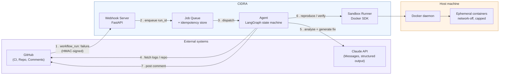
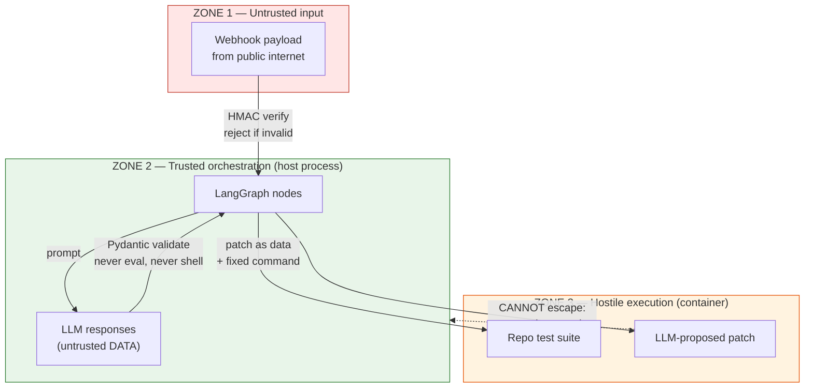
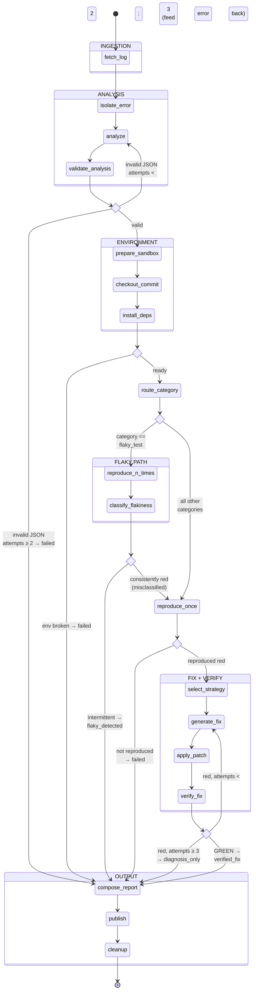
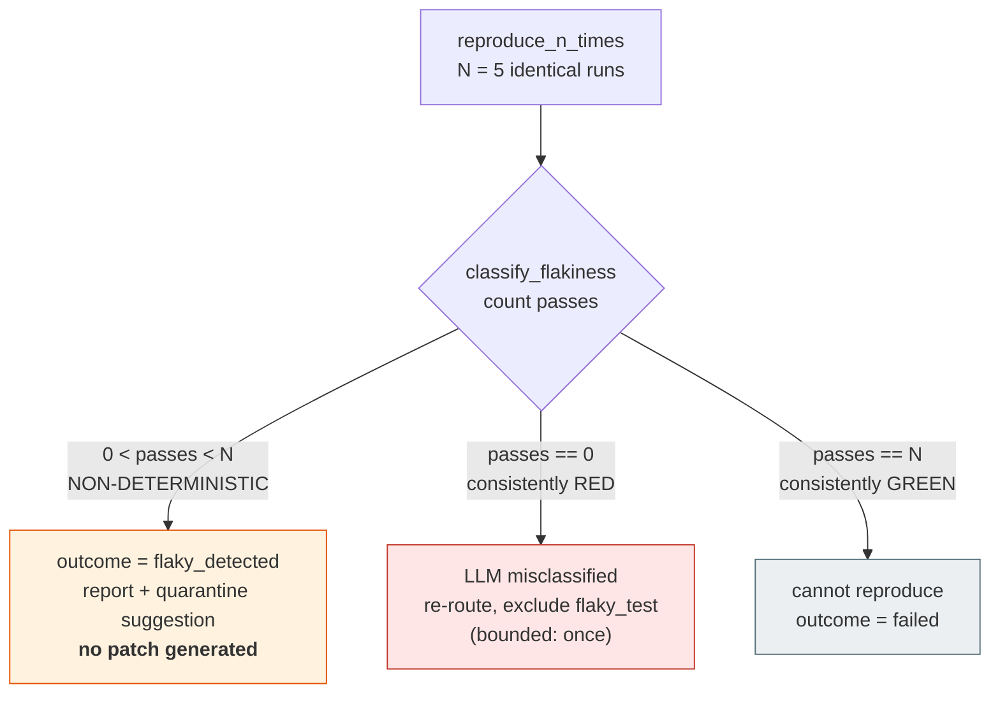
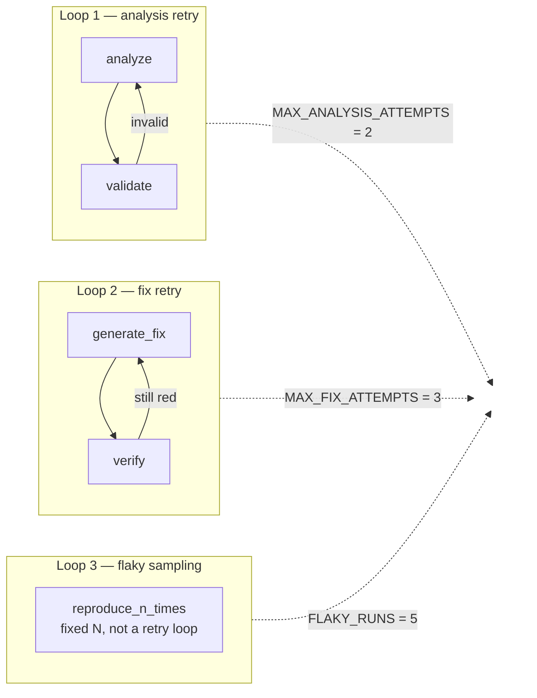
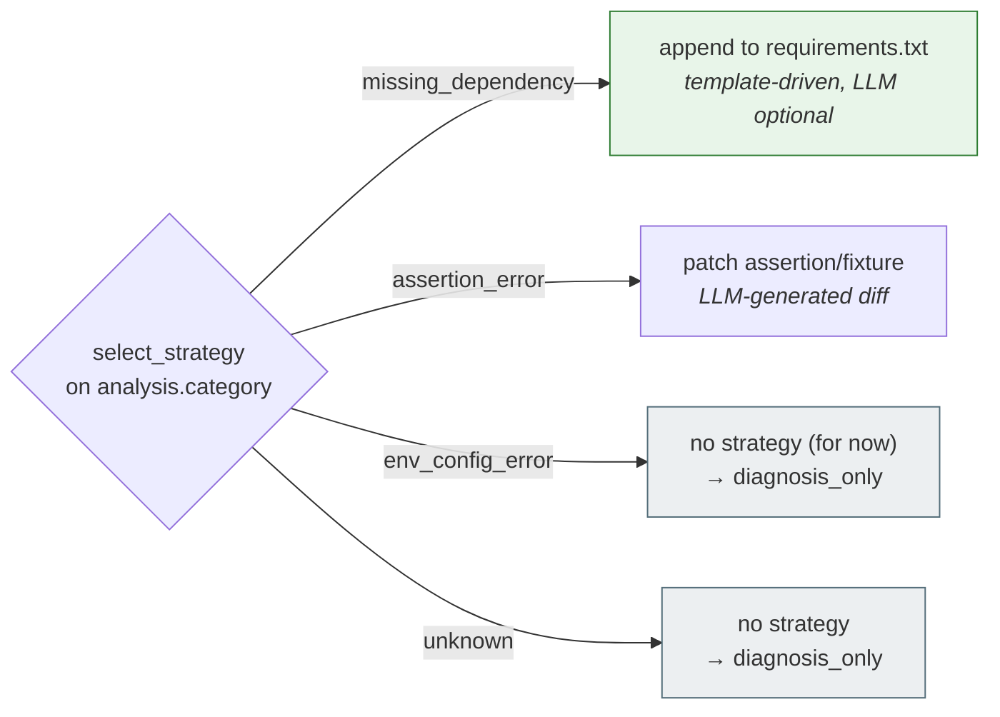
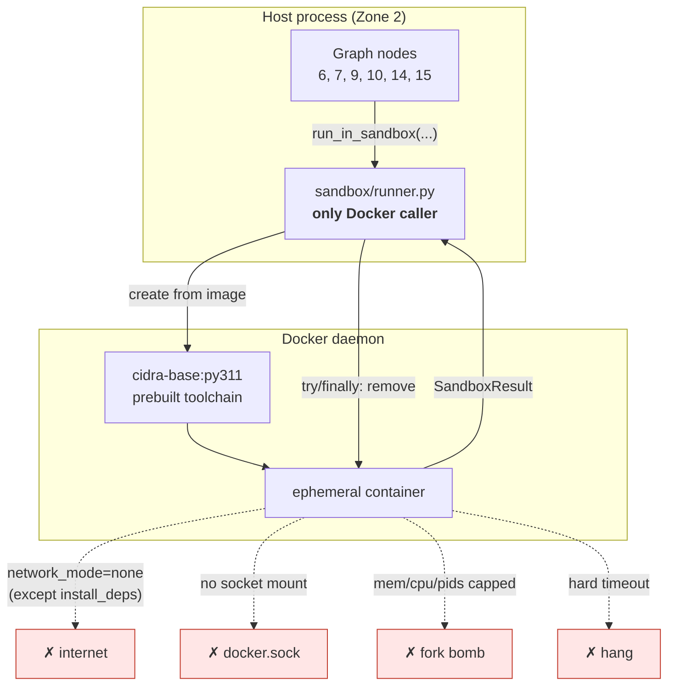
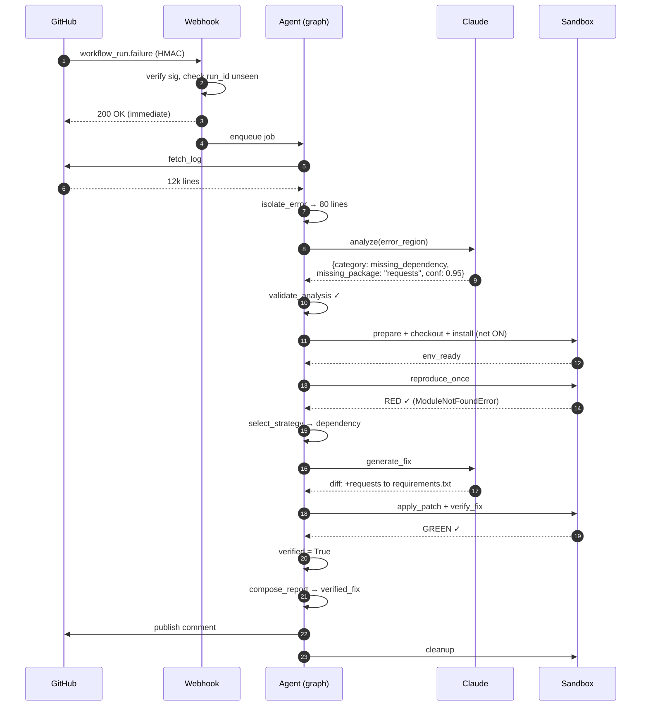
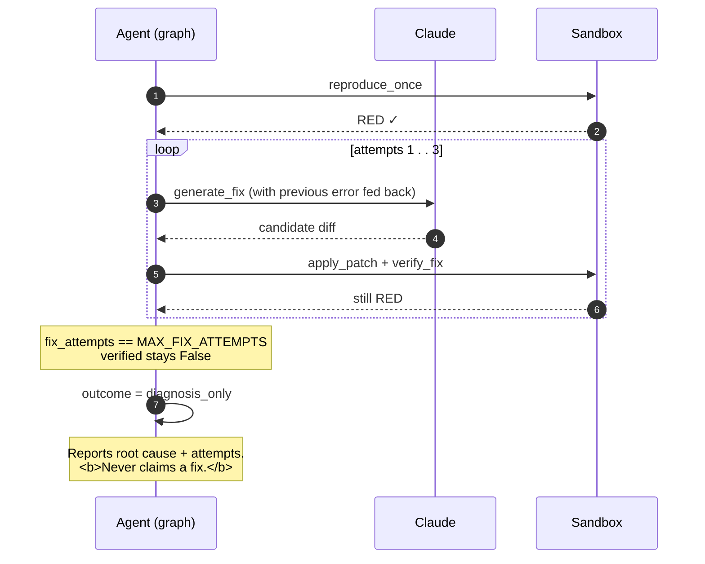
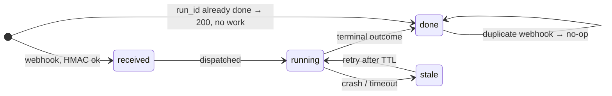

# Architecture — CIDRA (Continuous Integration Debugging and Repair Agent)

> This is the contract layer. [2_scope_and_decisions.md](2_scope_and_decisions.md) says *what*
> CIDRA does and doesn't do; this says *how the pieces are shaped*. Phase 0 builds the graph
> skeleton against this schema, and every later phase fills in nodes. If you can redraw §4
> from memory and explain who writes each field in §3, you understand the system.

**Contents**
1. [System context](#1-system-context)
2. [Trust boundaries](#2-trust-boundaries)
3. [`DebugState` — the state object](#3-debugstate--the-state-object)
4. [The LangGraph topology](#4-the-langgraph-topology)
5. [Node-by-node contracts](#5-node-by-node-contracts)
6. [Routing logic](#6-routing-logic)
7. [The sandbox subsystem](#7-the-sandbox-subsystem)
8. [Sequence walkthroughs](#8-sequence-walkthroughs)
9. [Module layout](#9-module-layout)
10. [Idempotency & concurrency](#10-idempotency--concurrency)
11. [Failure modes & known weaknesses](#11-failure-modes--known-weaknesses)

---

## 1. System context



Seven steps, three subsystems. The agent is the only component that talks to all three
external surfaces; everything else has exactly one job.

---

## 2. Trust boundaries

The single most important structural idea in CIDRA. Three zones, and code moves between them
under strict rules.



| Zone | Contains | Enforcement |
|---|---|---|
| 1 — Untrusted | Webhook payloads | HMAC-SHA256 verification before parsing anything |
| 2 — Trusted | Graph, routers, state | Never `eval`/`exec`/shell-interpolates LLM output |
| 3 — Hostile | Repo code, LLM patches | Runs only in a container: no network, no docker socket, resource-capped, hard timeout |

**The rule that matters:** the LLM's output is untrusted *even though we wrote the prompt*.
It crosses into Zone 3 as **data** — a unified diff to apply, never a command string the host
builds a shell call from. See §7 for how the API shape enforces this.

---

## 3. `DebugState` — the state object

Every node is `state in → partial state out`. No node reaches outside this object for input,
and no node writes a field it doesn't own.

```python
from typing import TypedDict, Literal, Optional
from pydantic import BaseModel, Field

FailureCategory = Literal[
    "missing_dependency",    # rank 1
    "assertion_error",       # rank 2
    "env_config_error",      # rank 3
    "flaky_test",            # rank 4 — structurally distinct path, see §4.3
    "unknown",               # out of scope or analysis failed
]

Outcome = Literal[
    "verified_fix",     # patch proven green in sandbox
    "flaky_detected",   # non-determinism confirmed; no patch attempted
    "diagnosis_only",   # root cause identified, fix not achieved
    "failed",           # could not reproduce or could not diagnose
]

class Analysis(BaseModel):
    """LLM output. Pydantic-validated. `category` is what routes the graph."""
    category: FailureCategory
    confidence: float = Field(ge=0.0, le=1.0)
    evidence: str                          # verbatim log lines supporting the call
    proposed_action: str                   # human-readable intent, NOT code
    file: Optional[str] = None
    line: Optional[int] = None
    failing_test: Optional[str] = None     # "tests/test_api.py::test_auth"
    missing_package: Optional[str] = None  # rank-1 only
    env_var: Optional[str] = None          # rank-3 only

class SandboxResult(BaseModel):
    """One container execution. Immutable record."""
    step: Literal["checkout", "install", "test", "verify"]
    exit_code: int
    stdout_tail: str          # TRUNCATED — full output never enters state
    stderr_tail: str
    duration_s: float
    timed_out: bool
    passed: bool

class DebugState(TypedDict, total=False):
    # ---- Identity — written by entrypoint, read by everything ----
    run_id: str                   # idempotency key
    repo: str                     # "owner/name"
    commit_sha: str
    workflow_file: Optional[str]

    # ---- Ingestion — written by fetch_log / isolate_error ----
    raw_log: str                  # NEVER sent to the LLM
    error_region: str             # ~50-200 lines; the LLM's actual input
    log_markers: list[str]        # which anchors matched (debuggability)

    # ---- Analysis — written by analyze / validate_analysis ----
    analysis: Optional[Analysis]
    analysis_attempts: int        # bounded: MAX_ANALYSIS_ATTEMPTS = 2
    analysis_error: Optional[str] # last validation failure, fed back on retry

    # ---- Environment — written by prepare_sandbox ----
    image_tag: Optional[str]      # base image used
    env_ready: bool

    # ---- Reproduction — written by reproduce_once / reproduce_n_times ----
    reproduced: bool
    repro_results: list[SandboxResult]
    flaky_pass_count: Optional[int]   # flaky path only: passes out of N

    # ---- Fix + verify — written by generate_fix / apply_patch / verify_fix ----
    fix_diff: Optional[str]
    fix_attempts: int             # bounded: MAX_FIX_ATTEMPTS = 3
    patch_applied: bool
    verified: bool                # HARD INVARIANT — see below
    verify_results: list[SandboxResult]

    # ---- Terminal — written by compose_report / publish ----
    outcome: Outcome
    final_output: str
    comment_url: Optional[str]
```

### 3.1 Field ownership

Exactly one writer per field. This is what keeps agent state from becoming a mess.

| Field group | Sole writer | Readers |
|---|---|---|
| `run_id`, `repo`, `commit_sha` | entrypoint | all nodes |
| `raw_log` | `fetch_log` | `isolate_error` only |
| `error_region`, `log_markers` | `isolate_error` | `analyze`, `compose_report` |
| `analysis`, `analysis_attempts` | `analyze` / `validate_analysis` | routers, fix nodes, report |
| `reproduced`, `repro_results` | `reproduce_once` / `reproduce_n_times` | routers, report |
| `fix_diff`, `fix_attempts` | `generate_fix` | `apply_patch`, `verify_fix`, report |
| **`verified`** | **`verify_fix` only** | `route_after_verify`, `compose_report` |
| `outcome`, `final_output` | `compose_report` | `publish` |

> **Why `verified` has exactly one writer:** it is the field the entire pitch rests on
> (scope doc §7 — *zero false "fixed" claims*). Only the node that actually observed a green
> container run can set it. This is a structural guarantee, not a code-review convention.

---

## 4. The LangGraph topology

### 4.1 Full graph



### 4.2 Why this many nodes

The temptation is to collapse this into six fat nodes. Don't — each split below exists for
a reason:

| Split | Why it's separate |
|---|---|
| `fetch_log` / `isolate_error` | Isolation must be **pure** so Phase 2 can regression-test it against fixtures with zero mocking |
| `analyze` / `validate_analysis` | Retry-on-malformed-JSON needs its own edge; folding it in means a hidden loop inside a node |
| `prepare_sandbox` / `checkout_commit` / `install_deps` | Three different failure modes with three different messages. Also: `install_deps` is the **only** step allowed network access (§7) |
| `reproduce_once` / `reproduce_n_times` | Fundamentally different semantics — one expects red, the other expects *inconsistency* (§4.3) |
| `select_strategy` / `generate_fix` | Strategy selection is deterministic per-category routing; generation is an LLM call. Keeping them apart means you can unit-test routing without burning tokens |
| `generate_fix` / `apply_patch` / `verify_fix` | A patch can fail to *apply* (malformed diff) — that's a different failure than a patch that applies but doesn't fix. Separate nodes, separate error messages |
| `compose_report` / `publish` | Report composition is pure and testable; publishing does network I/O. Also lets you dry-run the full graph with publishing disabled |
| `cleanup` | Runs on **every** terminal path. Containers/volumes must never leak |

### 4.3 The flaky-test path — why it's structurally different

This is the design decision that must exist in the architecture, not be discovered mid-build.
Scope doc §2 ranks flaky last precisely because it does not fit the `fix → verify` shape.



| Dimension | Ranks 1-3 (dependency / assertion / config) | Rank 4 (flaky) |
|---|---|---|
| Reproduction | 1 run, expect **consistently red** | **N=5 runs**, expect **inconsistency** |
| Fix generation | Yes — LLM produces a unified diff | **None.** There is no code fix to make |
| Success signal | Sandbox turns **green** after patch | Non-determinism **confirmed** across runs |
| Terminal outcome | `verified_fix` | `flaky_detected` |

```python
def classify_flakiness(state: DebugState) -> dict:
    results = state["repro_results"]
    passes = sum(r.passed for r in results)
    n = len(results)
    if 0 < passes < n:
        return {"flaky_pass_count": passes, "outcome": "flaky_detected"}
    if passes == n:
        return {"flaky_pass_count": passes, "reproduced": False}   # → failed
    return {"flaky_pass_count": 0, "reproduced": True}             # misclassified → rank 1-3
```

> This is the differentiator named in scope doc §0. OpenHands' own material concedes that
> non-determinism breaks its pass/fail feedback loop. CIDRA's answer is that flakiness gets a
> **first-class terminal outcome** rather than being forced through a fix-verify cycle that
> cannot produce a meaningful signal.

### 4.4 Bounded loops

Three loops exist. All are bounded, and the constants live in one config module — these are
the numbers an interviewer will ask about.



Loop 3 is not a retry loop — it is a fixed-N sample. Worth stating because it's the one that
looks unbounded at a glance.

---

## 5. Node-by-node contracts

Build checklist for Phases 2-7. "Pure" means no I/O — trivially testable against fixtures.

| # | Node | Reads | Writes | I/O | Pure | Phase |
|---|---|---|---|---|---|---|
| 1 | `fetch_log` | `run_id`, `repo` | `raw_log` | GitHub | ✗ | 2 |
| 2 | `isolate_error` | `raw_log` | `error_region`, `log_markers` | — | ✓ | 2 |
| 3 | `analyze` | `error_region`, `analysis_error` | `analysis`(raw), `analysis_attempts` | Claude | ✗ | 3 |
| 4 | `validate_analysis` | raw LLM output | `analysis`, `analysis_error` | — | ✓ | 3 |
| 5 | `prepare_sandbox` | `repo` | `image_tag` | Docker | ✗ | 4 |
| 6 | `checkout_commit` | `commit_sha` | `env_ready`, `repro_results[+]` | Docker | ✗ | 4 |
| 7 | `install_deps` | — | `env_ready`, `repro_results[+]` | Docker **+net** | ✗ | 4 |
| 8 | `route_category` | `analysis.category` | — (router) | — | ✓ | 4 |
| 9 | `reproduce_once` | `analysis.failing_test` | `reproduced`, `repro_results[+]` | Docker | ✗ | 4 |
| 10 | `reproduce_n_times` | `analysis.failing_test` | `repro_results[×N]` | Docker ×N | ✗ | 5 |
| 11 | `classify_flakiness` | `repro_results` | `flaky_pass_count`, `outcome` | — | ✓ | 5 |
| 12 | `select_strategy` | `analysis.category` | — (router) | — | ✓ | 5 |
| 13 | `generate_fix` | `analysis`, `error_region`, last `verify_results` | `fix_diff`, `fix_attempts` | Claude | ✗ | 5 |
| 14 | `apply_patch` | `fix_diff` | `patch_applied` | Docker | ✗ | 5 |
| 15 | `verify_fix` | — | **`verified`**, `verify_results` | Docker | ✗ | 5 |
| 16 | `compose_report` | everything | `outcome`, `final_output` | — | ✓ | 6 |
| 17 | `publish` | `final_output` | `comment_url` | GitHub | ✗ | 6 |
| 18 | `cleanup` | — | — | Docker | ✗ | 4 |

Six pure nodes out of eighteen. Those six are your cheap, fast, deterministic test surface —
build them first in each phase.

### 5.1 Fix strategies (node 12 → 13)

`select_strategy` is deterministic dispatch; only `generate_fix` calls the LLM.



Note `missing_dependency` (rank 1) is nearly template-driven — `analysis.missing_package`
plus an append. That's *why* it's rank 1: highest reliability, least LLM dependence.

**Decision: `env_config_error` has no fix strategy yet (2026-08-22).** `patch_workflow`
would edit `.github/workflows/ci.yml`, but the sandbox never reads that file — it invokes
`pytest` directly, so a workflow edit is invisible to `verify_fix`. Applying the patch and
then "verifying" it in the sandbox would either fail a correct fix or pass one that was
never actually exercised. Both violate the one rule that matters most: never claim a fix
that wasn't verified.

So `env_config_error` is intentionally absent from `STRATEGIES` in `cidra/nodes/fix.py`.
`select_strategy` returns `fix_strategy: None`, and `route_after_strategy` sends it straight
to `compose_report` — same path as `unknown` — for `outcome: diagnosis_only` with zero LLM
calls. This is correct behavior for a fixture like F-03 (env-config break), not a stub: it's
the honest answer given what the sandbox can actually verify today.

**Reintroduce it (Option C) when workflow fixes need to go further than diagnosis** — e.g.
opening a PR in Phase 6/7. That requires the sandbox to parse `ci.yml`'s `env:` block and
inject those vars before running the test, so the sandbox run fails without the fix and
passes with it — i.e., *real* verification of a workflow-level change, not sandbox theater.

---

## 6. Routing logic

Every conditional edge is a small pure function. No LLM calls, no I/O — just reads of state.

```python
def route_after_validate(state) -> str:
    if state.get("analysis") is not None:
        return "prepare_sandbox"
    return "analyze" if state["analysis_attempts"] < MAX_ANALYSIS_ATTEMPTS else "compose_report"

def route_after_env(state) -> str:
    return "route_category" if state["env_ready"] else "compose_report"

def route_category(state) -> str:
    return ("reproduce_n_times"
            if state["analysis"].category == "flaky_test"
            else "reproduce_once")

def route_after_flaky(state) -> str:
    if state.get("outcome") == "flaky_detected":
        return "compose_report"
    return "reproduce_once" if state["reproduced"] else "compose_report"

def route_after_reproduce(state) -> str:
    return "select_strategy" if state["reproduced"] else "compose_report"

def route_after_verify(state) -> str:
    if state["verified"]:
        return "compose_report"
    return "generate_fix" if state["fix_attempts"] < MAX_FIX_ATTEMPTS else "compose_report"
```

All six fit on one screen and are unit-testable with a dict — no mocking, no tokens.

---

## 7. The sandbox subsystem

The graph never touches Docker directly. One module owns it, so hardening lives in exactly
one place (scope doc §6 rules are enforced here or nowhere).



```python
def run_in_sandbox(
    step: Literal["checkout", "install", "test", "verify"],
    repo: str,
    commit_sha: str,
    command: str,                     # fixed, from our code — never LLM-authored
    patch: Optional[str] = None,      # unified diff, applied post-checkout
    network: bool = False,            # True ONLY for step == "install"
    timeout_s: int = DEFAULT_TIMEOUT,
) -> SandboxResult:
    """
    Contract:
      - container created, used, destroyed within this call (try/finally)
      - network_mode="none" unless network=True
      - mem_limit / cpu_quota / pids_limit ALWAYS set
      - never --privileged; never mounts /var/run/docker.sock
      - returns a SandboxResult even on timeout/crash; raises only on infra failure
    """
```

**The API shape is itself a safety control.** There is no `privileged` parameter to pass and
no way to opt out of the caps — a caller cannot weaken isolation without editing this module.
`command` is always constructed by CIDRA's own code; the LLM only ever supplies `patch`, which
is data. Full flags, base-image contents, and the adversarial test set → `6_sandbox_spec.md`.

---

## 8. Sequence walkthroughs

### 8.1 Happy path — missing dependency (rank 1)



### 8.2 Flaky path (rank 4)

```mermaid
sequenceDiagram
    autonumber
    participant AG as Agent (graph)
    participant AI as Claude
    participant SB as Sandbox

    AG->>AI: analyze(error_region)
    AI-->>AG: {category: flaky_test, conf: 0.7}
    AG->>AG: route_category → FLAKY branch

    loop N = 5 identical runs
        AG->>SB: reproduce (same commit, same test)
        SB-->>AG: pass / fail
    end

    AG->>AG: classify_flakiness → 3 fail, 2 pass
    Note over AG: 0 &lt; passes &lt; N ⇒ non-deterministic
    AG->>AG: outcome = flaky_detected<br/><b>no fix generated</b>
    AG->>AG: compose_report (flakiness + quarantine advice)
```

### 8.3 Degraded path — fix never goes green



That last note is the §7 invariant made visible: an unverified patch is reported as a
suggestion under `diagnosis_only`, never as a fix.

---

## 9. Module layout

```
cidra/
├── config.py                 # ALL bounds/limits/constants in one place
├── state.py                  # DebugState, Analysis, SandboxResult, Outcome
├── graph.py                  # graph assembly: nodes + edges + routers
├── routers.py                # the six pure routing functions (§6)
├── nodes/
│   ├── ingest.py             # fetch_log, isolate_error              (Ph 2)
│   ├── analyze.py            # analyze, validate_analysis            (Ph 3)
│   ├── environment.py        # prepare_sandbox, checkout, install    (Ph 4)
│   ├── reproduce.py          # reproduce_once, reproduce_n_times,
│   │                         # classify_flakiness                    (Ph 4/5)
│   ├── fix.py                # select_strategy, generate_fix,
│   │                         # apply_patch, verify_fix               (Ph 5)
│   └── publish.py            # compose_report, publish, cleanup      (Ph 6)
├── sandbox/
│   ├── runner.py             # run_in_sandbox — ONLY Docker caller
│   ├── limits.py             # mem/cpu/pids/timeout constants
│   └── Dockerfile.base       # prebuilt toolchain image
├── integrations/
│   ├── llm.py                # Claude client, structured output, Pydantic
│   └── github.py             # log fetch + comment (PR creation = Ph 9)
├── server/
│   ├── app.py                # FastAPI webhook                       (Ph 7)
│   ├── security.py           # HMAC verification
│   └── jobs.py               # queue + idempotency store
├── prompts/                  # versioned templates (→ 7_prompts.md)
└── eval/
    ├── fixtures/             # saved logs + expected JSON            (Ph 1)
    ├── adversarial/          # sandbox escape attempts               (Ph 4/6)
    └── run_eval.py           # regenerates the eval table (scope §7)
```

`eval/` sits alongside source rather than inside `tests/` deliberately — per scope doc §7 the
eval table is a **primary deliverable**, not test scaffolding. It re-runs after every prompt
or logic change.

---

## 10. Idempotency & concurrency

Webhook retries are guaranteed, so this is not optional.



- **Key on `run_id`.** Check the store before enqueuing. Already present → 200, do nothing.
- **Record transitions, not just completion.** A crash leaves `running`; a TTL lets a retry
  reclaim it.
- **One job per `run_id` at a time.** Two containers racing the same commit wastes resources
  and can produce contradictory `verified` values.
- Handler does the minimum before 200: verify HMAC → parse ids → idempotency check → enqueue.

---

## 11. Failure modes & known weaknesses

Stated deliberately so they're design decisions, not surprises. These belong in the README —
naming them is stronger than pretending they don't exist.

| # | Weakness | Mitigation / stance |
|---|---|---|
| 1 | `analysis.failing_test` missing or wrong → `reproduce_once` doesn't know what to run | Fall back to running the whole suite. Slower, still correct |
| 2 | **Green-but-wrong fix** — LLM edits the assertion to match buggy behaviour | Verification proves *the build goes green*, not *the code is correct*. Stated plainly in README |
| 3 | `install_deps` requires network — a real hole in isolation | Scoped to that single step; every other step is `network_mode=none`. Documented, not hidden |
| 4 | Flaky detection at N=5 is statistical, not proof — a 1-in-50 flake reads as passing | Report the sensitivity limit alongside the finding |
| 5 | LLM misclassifies a hard failure as flaky | `classify_flakiness` catches `passes == 0` and re-routes once (§4.3) |
| 6 | Malformed diff from LLM fails to apply | `apply_patch` is its own node with its own error path; counts against `fix_attempts` |
| 7 | Container leak on crash | `cleanup` runs on every terminal path; `run_in_sandbox` uses try/finally independently |

---

## 12. Open items → next docs

| Doc | Contents | Phase |
|---|---|---|
| `5_fixtures.md` | Practice repo, broken commits, saved logs, expected JSON | 1 |
| `6_sandbox_spec.md` | Exact flags, base image, adversarial test set | 4 |
| `7_prompts.md` | Prompt text, schema, few-shots, version log | 3 |
| `8_api_contracts.md` | Webhook payload, HMAC steps, idempotency store | 7 |
