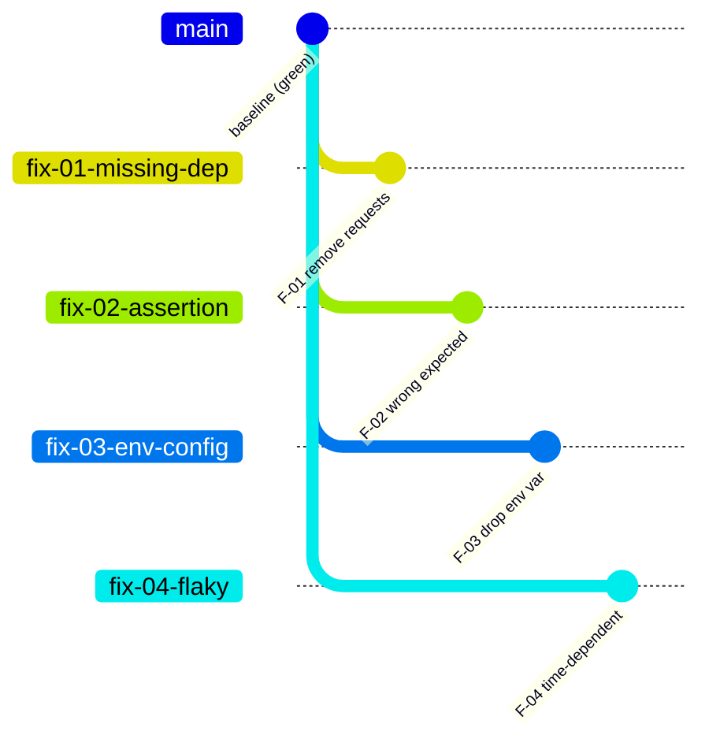
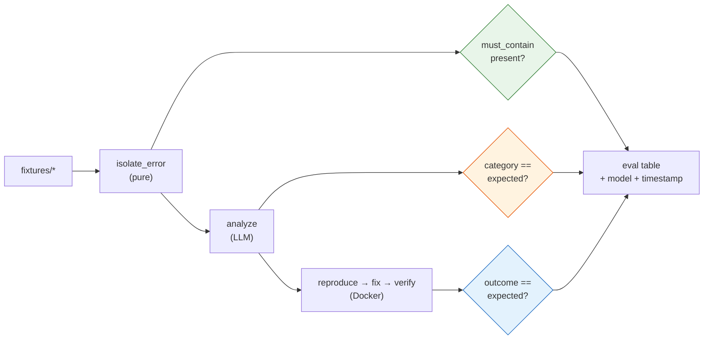

# Fixture Corpus — CIDRA

> **Phase 1 deliverable. Build this before writing any pipeline logic.**
>
> This is the offline dev loop. Every exit criterion in Phases 2-6 is phrased as *"works
> against every fixture."* It is simultaneously: the regression suite, the eval table's data
> source ([2_scope_and_decisions.md](2_scope_and_decisions.md) §7), and the demo script.
>
> Rule from the understanding doc §6: **develop against saved logs, never live CI.** Free,
> instant, deterministic. Live webhook is the last 10%, not the first.

---

## 1. What a fixture is

One fixture = one reproducible CI failure, captured completely enough to replay offline forever.

```
eval/fixtures/<fixture_id>/
├── meta.json          # commit sha, class, repo path, failing test
├── raw.log            # the full CI log, exactly as GitHub returned it
├── expected.json      # hand-written ground truth Analysis (§4)
└── notes.md           # how it was created, what makes it interesting
```

Nothing in a fixture is generated by CIDRA. `expected.json` is written **by you, by hand**,
before the analyze node exists. That's what makes it ground truth rather than a snapshot of
whatever the model happened to say.

---

## 2. The practice repo

A dedicated throwaway repo — never a real project (understanding doc §6).

```
cidra-practice/
├── .github/workflows/ci.yml     # runs pytest on push
├── requirements.txt
├── src/
│   └── calc.py
└── tests/
    ├── test_calc.py
    ├── test_api.py
    └── test_timing.py           # home of the flaky fixture
```

**Structure: one broken commit per fixture, each branched off a known-green baseline.**



Branches rather than sequential commits on `main`, so each failure is isolated — no fixture
inherits another's breakage, and each can be checked out independently by `checkout_commit`
([4_architecture.md](4_architecture.md) §5, node 6).

**Requirements:**
- CI must actually run and actually go red — you need the real log, not a hand-written one.
- Record the commit SHA **after** pushing (it's the sandbox checkout target).
- Keep the baseline green and tagged; `verify_fix` success means "back to baseline behaviour."

---

## 3. The corpus

Ranked per scope doc §2. Rank order is build order.

| ID | Rank | Class | Break | Expected fix |
|---|---|---|---|---|
| `F-01` | 1 | `missing_dependency` | Remove `requests` from `requirements.txt`, keep the import | Append `requests` |
| `F-02` | 2 | `assertion_error` | Change expected value in `test_calc.py` (`assert add(2,2) == 5`) | Patch to `4` |
| `F-03` | 3 | `env_config_error` | Delete `API_TOKEN` from `ci.yml` env block; test reads it | Restore env key in workflow |
| `F-04` | 4 | `flaky_test` | Time/random-dependent assertion in `test_timing.py` | **None** — classify as flaky |

### 3.1 Minimum vs target

| | Minimum (hackathon floor) | Target |
|---|---|---|
| Fixtures per class | 1 | 2-3 |
| Total | 4 | 8-12 |

Phase 1 exit criteria only require rank-1 and rank-2 to have full logs + expected JSON; rank-3
and rank-4 can exist as broken commits with logs following in Phase 2.

**If short on time, cut fixture *count*, never fixture *classes*.** One fixture per class
still exercises every graph path. Zero fixtures for a class means that class is untested and
must be dropped from the README claim entirely (scope doc §7 invariant).

### 3.2 Second fixtures (when you get to the target)

Variations that stress the same class differently — this is where real eval value lives:

| ID | Rank | Variation | Stresses |
|---|---|---|---|
| `F-01b` | 1 | Transitive dep missing (import in a submodule, not the test) | Does isolation find the right traceback frame? |
| `F-02b` | 2 | Off-by-one in a loop boundary, not a literal | Can the model patch logic, not just a constant? |
| `F-03b` | 3 | Env var present but empty string | Distinguishing "missing" from "wrong" |
| `F-04b` | 4 | Flaky at ~1-in-3 rather than ~1-in-2 | N=5 sensitivity limit (arch doc §11.4) |

`F-04b` is deliberately near the detection threshold — it's how you honestly report the
sensitivity limit rather than claiming flaky detection always works.

### 3.3 Negative fixtures (small but high-value)

| ID | Class | Purpose |
|---|---|---|
| `N-01` | `unknown` | A failure outside all four classes (e.g. genuine logic bug). **Expected outcome: `diagnosis_only` or `failed` — never a fix claim.** |
| `N-02` | infra noise | CI failure with no test failure (runner died / OOM). Expected: `failed`, no hallucinated root cause |

These test the thing that actually distinguishes an honest system: **correct refusal**. A
system that produces a confident wrong answer on `N-01` is worse than one that says "out of
scope." Include at least `N-01`.

---

## 4. `expected.json` — ground truth

Hand-written, before the analyze node exists. Mirrors the `Analysis` model
([4_architecture.md](4_architecture.md) §3).

```json
{
  "fixture_id": "F-01",
  "commit_sha": "<sha>",
  "expected_analysis": {
    "category": "missing_dependency",
    "missing_package": "requests",
    "failing_test": "tests/test_api.py::test_fetch",
    "file": "requirements.txt"
  },
  "expected_outcome": "verified_fix",
  "must_contain_in_error_region": [
    "ModuleNotFoundError: No module named 'requests'"
  ],
  "scoring": {
    "category": "exact",
    "missing_package": "exact",
    "failing_test": "exact",
    "file": "exact"
  }
}
```

**Scoring rules — what counts as correct:**

| Field | Match type | Rationale |
|---|---|---|
| `category` | Exact | Drives routing. Wrong category = wrong path = failure |
| `missing_package`, `env_var` | Exact | Mechanical extraction; no excuse for fuzziness |
| `failing_test` | Exact | Feeds the sandbox test command |
| `file` | Exact | Determines what gets patched |
| `confidence` | **Not scored** | Self-reported; useful signal, not ground truth |
| `evidence`, `proposed_action` | **Not scored** | Free text. Eyeball during review, don't grade |

Only score what's mechanically checkable. Grading prose invites you to fudge the numbers.

`must_contain_in_error_region` is the **Phase 2 regression check** — asserts isolation kept
the actual error line, independent of the LLM entirely.

---

## 5. Capturing a fixture

```bash
# 1. branch from green baseline, introduce ONE break, push
git checkout -b fix-01-missing-dep main
# ...edit requirements.txt...
git commit -am "F-01: remove requests dep" && git push -u origin fix-01-missing-dep

# 2. wait for CI to go red, then grab the run id + full log
gh run list --branch fix-01-missing-dep --limit 1
gh run view <run-id> --log > eval/fixtures/F-01/raw.log

# 3. record identity
git rev-parse HEAD          # → commit_sha for meta.json
```

Then hand-write `expected.json` **from reading the log**, not from running any model.

`meta.json`:
```json
{
  "fixture_id": "F-01",
  "rank": 1,
  "class": "missing_dependency",
  "repo": "<user>/cidra-practice",
  "branch": "fix-01-missing-dep",
  "commit_sha": "<sha>",
  "github_run_id": "<run-id>",
  "captured_at": "2026-08-__",
  "log_lines": 0
}
```

Also save the raw webhook payload for each run (`payload.json`) — Phase 7 replays these
before the live webhook is wired, exactly as the understanding doc §3.1 recommends.

---

## 6. What the eval harness does with this

`eval/run_eval.py` walks every fixture and regenerates the scope doc §7 table.



Three tiers, increasing cost — run them independently:

| Tier | Needs | Cost | Run when |
|---|---|---|---|
| **1. Isolation** | nothing | free, instant | Every save |
| **2. Analysis** | LLM | cents | Every prompt change |
| **3. Full pipeline** | LLM + Docker | minutes | Before commit / demo |

Tier 1 being free and instant is *why* `isolate_error` is a pure node (arch doc §5).

**Record the model per row.** Per the earlier discussion, `analyze` on Haiku vs Sonnet is a
result worth showing — it demonstrates you measured the cost/quality tradeoff rather than
defaulting to the biggest model.

| Class | Fixtures | Model | Category ✓ | Repro red | Verified green | False "fixed" |
|---|---|---|---|---|---|---|
| missing_dependency | | | | | | |
| assertion_error | | | | | | |
| env_config_error | | | | | | |
| flaky_test | | | | n/a | n/a (flaky ✓) | |
| **negative** | | | n/a | n/a | **must be 0** | **must be 0** |

Last row is the invariant: negative fixtures must never produce a fix claim.

---

## 7. Phase 1 exit criteria

- [ ] Practice repo exists, baseline green and tagged
- [ ] `F-01` and `F-02` complete: broken commit, `raw.log`, `expected.json`, `meta.json`
- [ ] `F-03` and `F-04` exist as broken commits with recorded SHAs (logs may follow in Phase 2)
- [ ] `N-01` negative fixture exists
- [ ] Webhook `payload.json` saved for at least one run
- [ ] `eval/run_eval.py` skeleton runs Tier 1 and prints an (empty) table

Once these tick, Phases 2-6 have something to be measured against — and every later exit
criterion becomes objective instead of "looks right to me."
