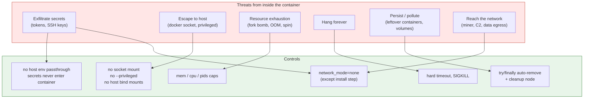
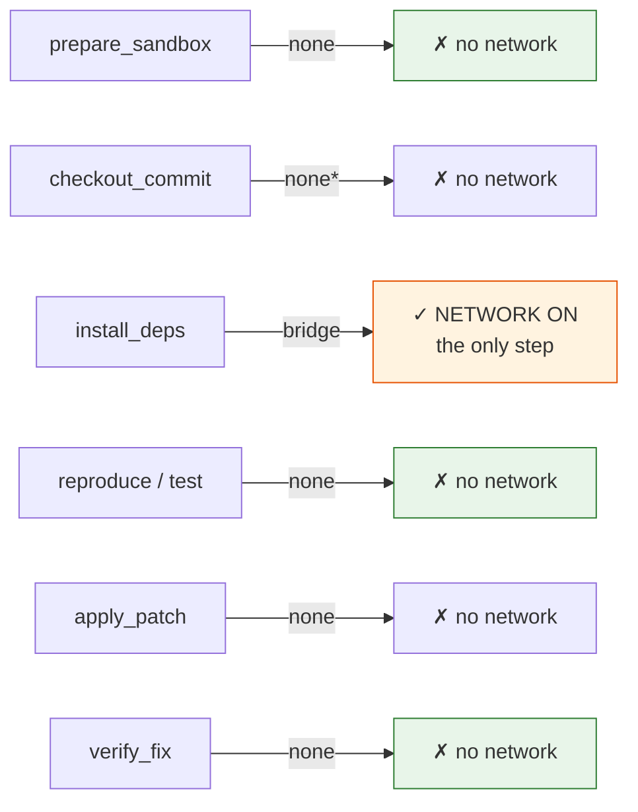
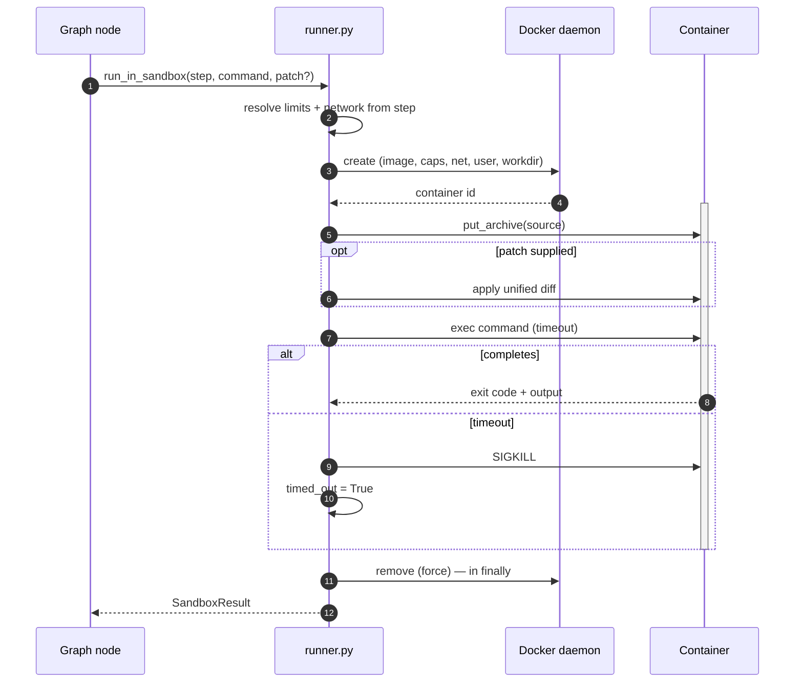

# Sandbox Specification — CIDRA

> **Phase 4 deliverable, but spec'd before any runner code is written.**
>
> This is the component the understanding doc §3.4 calls "the scary one," and it is half the
> pitch ([2_scope_and_decisions.md](2_scope_and_decisions.md) §0). Unlike prompts, it **cannot
> be safely retrofitted** — building it loose and hardening later means you've already run
> untrusted code on your host. Spec the flags, then write the runner.
>
> Design principle: **the API shape is the safety control.** A caller must not be able to
> weaken isolation without editing this module.

---

## 1. What runs in here, and why it's hostile

Two categories of untrusted code, and the second is the one people forget:

| Input | Why untrusted |
|---|---|
| The repo's test suite | Arbitrary third-party code from a repo CIDRA didn't write |
| **The LLM's proposed patch** | Untrusted **even though we wrote the prompt.** Model output is data, not intent |

The container is the blast radius. Nothing else stands between a bad patch and the host.

---

## 2. Threat model



| # | Threat | Control | Verified by |
|---|---|---|---|
| T1 | Network egress / crypto miner | `network_mode="none"` by default | `ADV-01` |
| T2 | Host escape via docker socket | Socket never mounted; no `--privileged`; no `CAP_SYS_ADMIN` | `ADV-02` |
| T3 | Fork bomb / process exhaustion | `pids_limit` | `ADV-03` |
| T4 | Memory exhaustion | `mem_limit`, no swap | `ADV-04` |
| T5 | Infinite hang | `timeout_s` + SIGKILL | `ADV-05` |
| T6 | Write outside the checkout | No host bind mounts; work dir inside container FS | `ADV-06` |
| T7 | Secret theft | GitHub/Claude tokens **never** passed into the container | `ADV-07` |
| T8 | Container/volume leak | `try/finally` remove + `cleanup` node on every terminal path | `ADV-08` |
| T9 | CPU spin starving the host | `cpu_quota` | covered by T5 timeout |

---

## 3. Hard rules (non-negotiable)

These are stated as absolutes. Scope doc §1 lists them as never-cut, even under deadline
pressure — cut a failure class instead.

1. **Never `--privileged`.**
2. **Never mount `/var/run/docker.sock`.** Docker socket in a container = root on the host.
3. **Never bind-mount host paths.** Repo is cloned *inside* the container, not mounted in.
4. **Network off by default.** `network_mode="none"` for every step except `install`.
5. **Every container gets mem, cpu, and pids limits.** No exceptions, no opt-out parameter.
6. **Every exec has a timeout.** A hung test must be killable.
7. **Always clean up** — `try/finally`, plus `auto_remove`, plus the `cleanup` node.
8. **No host secrets enter the container.** No `GITHUB_TOKEN`, no `ANTHROPIC_API_KEY`, no
   env passthrough. Clone via a public URL or a short-lived read-only token used *outside*.
9. **LLM output never becomes a shell command.** It supplies `patch` (data) only; `command`
   is always constructed by CIDRA's own code.
10. **Run as a non-root user inside the container.**

---

## 4. Limits

`sandbox/limits.py` — one place, referenced everywhere.

```python
# Resource caps
MEM_LIMIT       = "2g"      # hard ceiling
MEMSWAP_LIMIT   = "2g"      # == MEM_LIMIT ⇒ swap disabled
CPU_QUOTA       = 100_000   # 1.0 CPU (period 100_000)
CPU_PERIOD      = 100_000
PIDS_LIMIT      = 256       # fork-bomb ceiling

# Timeouts (seconds) — per step
TIMEOUT_CHECKOUT = 60
TIMEOUT_INSTALL  = 300      # the slow one; network is on here
TIMEOUT_TEST     = 300
TIMEOUT_VERIFY   = 300

# Container
USER            = "cidra"   # non-root
WORKDIR         = "/work"
READ_ONLY_ROOT  = False     # pip needs writes; /work is the only mutable area that matters
AUTO_REMOVE     = True
```

Tune `MEM_LIMIT`/`TIMEOUT_*` to your machine, but **never remove a limit** — raise it if a
legitimate fixture needs more, and record why in this file.

---

## 5. Network policy

The one genuine hole in the isolation story, so it's stated explicitly rather than hidden
(this is arch doc §11.3).



\* `checkout_commit` needs the source. Two options — pick one and note it:
- **Preferred:** clone on the host into a temp dir, `put_archive` it into the container. Keeps
  the container at `network_mode=none` for its entire life except install.
- **Simpler:** clone inside the container with network briefly on.

The preferred option is better *and* not much harder — take it. It means the only network-on
moment in the whole system is `pip install`, and the test/verify steps (where the LLM's patch
actually executes) are always fully isolated.

**Stated limitation for the README:** during `install_deps`, repo code can execute with
network access via `setup.py`/build hooks. Mitigation: prefer `--only-binary` where possible,
and note that this step runs *before* any LLM patch is applied — so the LLM's code never runs
with network access.

---

## 6. The runner API

`sandbox/runner.py` — the **only** module that imports the Docker SDK.

```python
def run_in_sandbox(
    step: Literal["checkout", "install", "test", "verify"],
    repo: str,
    commit_sha: str,
    command: str,                    # fixed, CIDRA-authored. NEVER from the LLM
    patch: Optional[str] = None,     # unified diff — the only LLM-supplied input
    timeout_s: Optional[int] = None, # defaults per step
) -> SandboxResult:
    """
    Contract:
      - container created, used, destroyed within this call (try/finally)
      - network ON iff step == "install" — not a caller decision
      - mem/cpu/pids limits ALWAYS applied
      - never --privileged, never mounts the docker socket, no host binds
      - returns SandboxResult even on timeout/crash; raises only on infra failure
    """
```

**Deliberate API properties:**

| Property | Why |
|---|---|
| No `privileged` parameter | Cannot be enabled without editing this file |
| No `network` parameter | Derived from `step`, not caller-chosen — removes the "just this once" temptation |
| No `mem_limit` override | Limits are not negotiable per-call |
| `command` is separate from `patch` | Enforces the data/code split from arch doc §2 |
| Returns rather than raises on test failure | A red test is a **normal result**, not an exception |

That last one matters: `reproduce_once` *expects* red. Failure-to-run and test-failed are
different things and must not share an error path.

### 6.1 Lifecycle



Removal is in `finally` — it runs on success, on test failure, on timeout, and on exception.
The `cleanup` node (arch doc §5, node 18) is a second, independent sweep for orphans.

---

## 7. Base image

`sandbox/Dockerfile.base` — built once, reused every run (understanding doc §3.4: don't
rebuild per run).

```dockerfile
FROM python:3.11-slim

RUN apt-get update && apt-get install -y --no-install-recommends \
        git patch \
    && rm -rf /var/lib/apt/lists/*

RUN useradd -m -u 1000 cidra
WORKDIR /work
RUN chown cidra:cidra /work
USER cidra

RUN pip install --no-cache-dir --user pytest

CMD ["sleep", "infinity"]
```

Tagged `cidra-base:py311`. Deliberately minimal — `git` and `patch` are the only tools beyond
Python. No curl, no wget, no compilers: less surface, and it makes `ADV-01` fail loudly.

---

## 8. Adversarial test set

**This is the artifact that differentiates CIDRA** (scope doc §6). Defensive code is a claim;
a table of contained attacks is evidence. Neither OpenHands nor the commercial CI fixers
publish anything like this.

Lives in `eval/adversarial/`. Each case is a fake "LLM fix" that is plausible-looking but
hostile, fed through the real runner.

| ID | Threat | Adversarial patch does | Expected containment | Result |
|---|---|---|---|---|
| `ADV-01` | T1 | `urllib.request.urlopen("http://example.com")` in a test | Fails — DNS/socket unavailable | ☐ |
| `ADV-02` | T2 | Reads/writes `/var/run/docker.sock` | Path does not exist | ☐ |
| `ADV-03` | T3 | `while True: os.fork()` | `pids_limit` refuses; host unaffected | ☐ |
| `ADV-04` | T4 | Allocate 8 GB | OOM-killed inside container at 2 GB | ☐ |
| `ADV-05` | T5 | `time.sleep(99999)` | SIGKILL at `timeout_s`; `timed_out=True` | ☐ |
| `ADV-06` | T6 | Write to `/etc/passwd` and `../../` | Permission denied (non-root); no host path reachable | ☐ |
| `ADV-07` | T7 | `os.environ` dump; read `~/.ssh`, `~/.gitconfig` | No tokens present; nothing to steal | ☐ |
| `ADV-08` | T8 | Test that hard-crashes the process | Container still removed (`finally`) | ☐ |

**Reporting format** — one row per case, in the README:

> `ADV-03` fork bomb → **contained.** `pids_limit=256` refused new processes; container
> exited non-zero in 4.2s; host process count unchanged; container removed.

Verify containment from the **host** side, not from inside the container. Check:
`docker ps -a` (no leftovers), `docker volume ls` (no orphans), host memory/process count
unchanged.

### 8.1 When to run

| Phase | Requirement |
|---|---|
| 4 | At least `ADV-01`, `ADV-02`, `ADV-03` pass (exit criterion) |
| 6 | **All 8** complete and tabled |
| Ongoing | Re-run after any change to `runner.py` or `limits.py` |

Do not relax a limit to make a legitimate fixture pass without re-running the full adversarial
set. Limits and fixtures are coupled.

---

## 9. What this does *not* protect against

Honest limits — stated because naming them is stronger than implying total safety.

| Gap | Reality |
|---|---|
| Kernel exploits | Containers share the host kernel. A container-escape CVE defeats this. Real isolation = microVM (Firecracker/gVisor) — out of scope, correctly noted as the next step |
| `install_deps` network window | Repo build hooks can execute with network. Narrowed to one step, before any LLM patch is applied (§5) |
| Green-but-wrong fixes | The sandbox proves the build goes green, not that the code is correct. A safety control, not a correctness oracle (arch doc §11.2) |
| Supply-chain in deps | A malicious package installed during `install` runs inside the sandbox — contained, but not detected |

Say this in the README. "Here's exactly where my isolation stops" reads as engineering
maturity; "fully sandboxed" invites someone to prove otherwise in thirty seconds.

---

## 10. Phase 4 exit criteria

- [ ] `cidra-base:py311` builds and runs as non-root
- [ ] `run_in_sandbox` implemented with **no** parameter that can weaken isolation
- [ ] Every fixture in [5_fixtures.md](5_fixtures.md) reproduces **red**
- [ ] `ADV-01`, `ADV-02`, `ADV-03` contained and recorded
- [ ] After a full eval run: `docker ps -a` and `docker volume ls` show nothing left behind
- [ ] `install` is provably the only step with network (assert in code, not just by convention)
