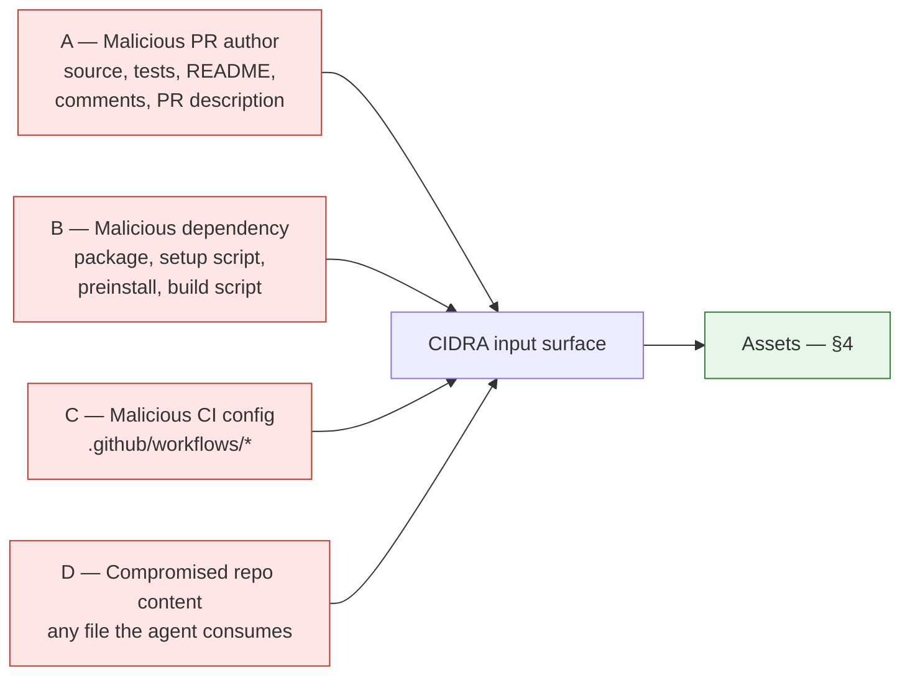

# Threat Model — CIDRA

> **Scope of this document:** who can attack CIDRA, what they control, what they are
> after, and which control stops them.
>
> It does **not** re-specify container flags — that is
> [6_sandbox_spec.md](../6_sandbox_spec.md) §2–§5, which covers threats *from inside the
> container* (T1–T9). This doc covers the layer above: threats that arrive as **input**,
> before any container exists. The sandbox is one control among several here, not the
> whole model.
>
> Companion docs: [attack_taxonomy.md](attack_taxonomy.md) (the attack chains, with
> real-world precedent) and [security_requirements.md](security_requirements.md)
> (the testable requirements).
>
> Grounded in [Research_Real_World_CI_CD_Attacks.md](../research/Research_Real_World_CI_CD_Attacks.md)
> and [Research_CI_Agent_Security.md](../research/Research_CI_Agent_Security.md).

---

## 1. Why CIDRA is a target at all

CIDRA is not a chatbot. It is a process that, on a webhook it does not control, reads
attacker-influenced text, asks an LLM about it, and then runs code. That is the
**"lethal trifecta"** named in the security research: private data access + code
execution + exposure to untrusted content, in one process.

Every incident in the research corpus — Clinejection, GitLost, Comment-and-Control, the
Claude Code `/proc/self/environ` leak — is the same shape. An attacker who could only
write *text* into GitHub reached *credentials* or *code execution*, because some agent
treated repository content as instructions while holding a privileged token.

The design question for CIDRA is therefore not "can we stop prompt injection?" — we
cannot, reliably; treat injection as **inevitable** — but:

> **Assume the LLM is fully controlled by the attacker on every run. What can it still do?**

That framing drives the whole model. Controls that reduce the *likelihood* of injection
(sanitizing, delimiting, instructing the model to ignore instructions) are hygiene, not
security. Controls that reduce the *consequence* — token scoping, the data/code split,
network-off execution, the human gate — are the actual security boundary.

---

## 2. Zones (recap from architecture §2, extended)

| Zone | Contains | Trust |
|---|---|---|
| 0 — Public | GitHub events, PR content, dependency registries | Fully hostile |
| 1 — Untrusted input | Webhook payload, CI logs, repo files, PR text | Hostile, but parsed by us |
| 2 — Trusted orchestration | LangGraph nodes, routers, `DebugState` | Trusted **code**, hostile **data** |
| 3 — Hostile execution | Repo test suite, LLM patch | Fully hostile, contained |
| 4 — Credentials | `CIDRA_API_KEY`, `CIDRA_GITHUB_TOKEN*` | Never enters Zone 3 |

The addition to [arch §2](../4_architecture.md) is **Zone 4**. Secrets are not "in" the
host process by accident; they are a distinct asset with its own boundary rule: *a secret
must never be reachable from a component that has read attacker-controlled text and can
also write outward.*

---

## 3. Attackers

Four attackers, distinguished by **what they control** — not by who they are. All four
are assumed capable and aware of every control in this repo.

### Attacker A — malicious PR author

**Controls:** source code, tests, README, code comments, PR title and description,
commit messages, branch name.

**Capability:** Opens a PR (from a fork, or as a low-trust contributor) against a repo
CIDRA watches. CI fails — possibly *deliberately*, because a failing build is exactly
what summons the agent. **A is the only attacker who chooses when CIDRA runs.**

**Reach:** Every one of those fields ends up in CIDRA's LLM context. Test *names* and
assertion messages appear in CI logs; source and comments appear in the fix prompt; PR
text appears in any node that reads PR metadata. There is no field A controls that the
model does not eventually see.

**Real precedent:** GitLost (public issue → private repo source leaked into a public
comment); Comment-and-Control (PR title → agent posts secrets back as a PR comment);
PromptPwnd (PR description → shell execution). Payloads hide in HTML comments
(`<!-- ... -->`) — invisible in GitHub's rendered UI, fully visible in the raw Markdown
the agent reads.

**Goal:** make CIDRA either (a) exfiltrate a secret, (b) commit attacker code to a branch
a human trusts, or (c) approve a patch that weakens the repo — the last being the cheapest
and least likely to be noticed.

**Assume A always succeeds at injection.** The only question is what the injected model
can then reach.

### Attacker B — malicious dependency

**Controls:** a package in the repo's dependency graph — its contents, `setup.py`,
`preinstall`/`postinstall` scripts, build hooks, wheel build backend.

**Capability:** Executes arbitrary code at *install* time, before any test runs and
before any patch is applied. Does not need CIDRA to be compromised, does not need the LLM
at all, and does not need A's cooperation. A typosquat or one compromised maintainer
account is sufficient.

**Reach:** `install_deps` is the **only** step where the network is on
([6_sandbox_spec.md](../6_sandbox_spec.md) §5). B's code runs there, with network, inside
the container. This is CIDRA's single acknowledged isolation hole and it is B's entire
attack surface.

**Real precedent:** Clinejection — an agent ran `npm install`, a malicious preinstall
script exfiltrated the runner's environment variables, and the attacker then poisoned the
Actions cache to steal publication tokens from a *later, more privileged* workflow.

**Goal:** exfiltrate whatever is in the install environment, and persist.

**What saves CIDRA here is not isolation, it is emptiness:** B gets network, but the
container holds no secrets to send (sandbox rule 8 / SR-08), no host mount to write
through, and no cache that outlives the run. B compromises the build of one throwaway
container. That is an accepted loss, stated as such.

### Attacker C — malicious CI configuration

**Controls:** `.github/workflows/*` — job definitions, triggers, `permissions:` blocks,
which secrets a job receives, and the actions it calls.

**Capability:** Two distinct powers, and the second is the dangerous one.

1. Shape what CIDRA reads: forge log content, manufacture a failure that mimics a known
   class, inject text into a job's output.
2. Escalate privilege: change a trigger to `pull_request_target`, widen `permissions:` to
   `write-all`, or hand `secrets` to a job that processes fork code.

C is where a *text* attacker becomes a *credential* attacker. In a normal repo C is
reachable only by someone who can merge — but the entire point of CIDRA is to propose
merges.

**Real precedent:** PromptPwnd's headline mitigation is literally "scan `.yml` actions with
Opengrep"; the OpenAI Codex action's own guidance is a standing warning against
`pull_request_target`.

**Goal:** turn a low-privilege position into a high-privilege one, then have CIDRA's own
output merged to make it permanent.

**Structural control:** CIDRA's tokens do not carry the GitHub **Workflows** scope
(`.env.example`), so CIDRA cannot write `.github/workflows/*` even if fully hijacked, and
a CIDRA-proposed patch touching CI config is rejected before it is ever offered (SR-14).
An agent that can edit `ci.yml` can turn CI green by deleting the tests — simultaneously
the laziest possible fix and a supply-chain attack.

### Attacker D — compromised repository content

**Controls:** any file the agent consumes as *context* rather than as *code to run* —
`AGENTS.md`, `CLAUDE.md`, `.cidra/`, docstrings, fixture files, `conftest.py`, and
notably `.git/config` and git hooks.

**Capability:** D is A's persistent form. Where A must open a PR each time, D's payload is
already in the tree, on the default branch, and fires on **every** run — including runs
triggered by innocent contributors. D also covers git-level attacks: a poisoned
`.git/config` or hook turns an ordinary `git checkout`/`git diff` into arbitrary code
execution wherever git is invoked.

**Real precedent:** the malicious git-config/hook chain (RCE from nothing more than
checking out a repo); agent instruction files (`AGENTS.md`, `CLAUDE.md`) read as
authoritative by Codex and Jules.

**Goal:** durable control of every CIDRA run against that repo, and RCE on whatever host
runs git.

**Structural control:** git operations happen on the *host* (the preferred checkout path,
[6_sandbox_spec.md](../6_sandbox_spec.md) §5), which makes hook execution a **host**
compromise rather than a container one. This is the sharpest edge in the current design and
is why SR-16/SR-17 exist.

---

## 4. Assets

Ranked by what losing them costs. The ranking matters: controls are allocated against the
top of the list, and an attack that reaches only the bottom of it is an accepted loss.

| # | Asset | Where it lives | Loss means | Zone |
|---|---|---|---|---|
| 1 | `CIDRA_GITHUB_TOKEN` (write) | Host env, publish node only | Attacker commits as CIDRA; merged code is trusted code | 4 |
| 2 | AI API key (`CIDRA_API_KEY`) | Host env, LLM client only | Billing theft, and a valid key is a foothold for further agent abuse | 4 |
| 3 | Repository write permission | The capability the write token grants | Supply-chain compromise of the watched repo | 4 |
| 4 | Cloud credentials | **Not present by design** — §4.1 | Would be total org compromise | — |
| 5 | Private source | Repo checkout, LLM context, CI logs | Leak — and A can simply *ask* for it (GitLost) | 1 |
| 6 | `CIDRA_GITHUB_TOKEN_RO` (read) | Host env, ingest node | Read access to private repo content | 4 |
| 7 | CI runner / host machine | The Docker host | RCE; pivot to everything above | Host |
| 8 | Filesystem (host) | Outside the container | Path to #1/#2 via env files and dotfiles | Host |
| 9 | Network (egress) | Host, and the install-step container | The exfiltration channel for #1–#6 | Host / 3 |
| 10 | Container filesystem | Inside the sandbox | Nothing — destroyed on exit | 3 |

**Two GitHub token entries, deliberately.** `.env.example` splits read from write precisely
because a CI log is untrusted input: the code that parses one must not be able to write to
the repo. That split is the highest-value control in this document, because it breaks the
Comment-and-Control chain *structurally* — the component that reads the payload holds no
token that can publish it.

### 4.1 Assets CIDRA deliberately does not hold

Listed because *absence is the control*, and because introducing any of these invalidates
this threat model:

- **Cloud credentials (AWS/GCP/Azure).** CIDRA never needs them. If a deployment grants
  them to the host, every attacker in §3 gains a path to full cloud compromise and this
  model must be rewritten.
- **Package-publishing tokens** (`NPM_TOKEN`, PyPI). Exactly what Clinejection stole.
  CIDRA publishes nothing.
- **The GitHub Workflows scope.** See Attacker C.
- **Organization-wide private repo read.** GitLost's severity came from an agent whose
  token could read *other* private repos. CIDRA's PATs are scoped to one repo.

---

## 5. Attacker × asset reachability

What each attacker reaches *today*, given current controls.
`✗` structurally blocked · `!` reachable, accepted, explained · `~` partially mitigated,
residual risk.

| Asset ↓ / Attacker → | A (PR author) | B (dependency) | C (CI config) | D (repo content) |
|---|---|---|---|---|
| Write GitHub token | ✗ read path holds no write token | ✗ never in container | ~ via a merged workflow change | ✗ same as A |
| AI API key | ✗ not in container; LLM gets no host shell | ✗ never in container | ~ if a workflow gains secrets | ✗ |
| Repo write permission | ~ plausible-but-malicious patch → **human gate** | ✗ | ~ | ~ |
| Cloud credentials | ✗ not present | ✗ not present | ✗ not present | ✗ not present |
| Private source | ~ model can be asked to summarize it into a comment | ✗ | ~ | ~ |
| Host RCE | ✗ patch executes only in container | ✗ contained at install | ✗ | **!** git hooks on host checkout |
| Network egress | ✗ network off in test/verify | **!** install step, by design | ~ | ✗ |
| Container FS | ! irrelevant — destroyed | ! irrelevant | — | ! irrelevant |

The three non-`✗` cells are the honest residual risk of this design:

1. **B at install.** Accepted: the container holds nothing worth taking. Bounded by SR-08
   (no secrets in container) and SR-09 (network only at install).
2. **D via git hooks on the host.** The real one. Mitigated by SR-16
   (`GIT_CONFIG_NOSYSTEM`, `protocol.file.allow=never`, `core.hooksPath=/dev/null`) and
   SR-17 (no git command runs under repo-supplied config).
3. **A via a malicious-but-green patch.** Not technically solvable — a patch that passes
   the tests *and* is malicious is by construction indistinguishable from a good one. Hence
   output mode is a **suggestion a human approves**
   ([2_scope_and_decisions.md](../2_scope_and_decisions.md) §4), and SR-13/SR-14 constrain
   what a patch may touch. The EU AI Act's Article 14 human-oversight obligation lands on
   the same answer for independent reasons.

---

## 6. The two rules everything reduces to

Every control in [security_requirements.md](security_requirements.md) is an instance of one
of these. A future change that violates either is a security regression regardless of which
tests pass.

**Rule 1 — Split read from write.**
The component that consumes attacker-controlled text must not hold a credential that can
write anywhere the attacker can observe. Hence two GitHub tokens, hence the ingest node
using the read-only one, hence no secret in the container.
*Breaks: Comment-and-Control, GitLost, Clinejection's exfiltration stage.*

**Rule 2 — LLM output is data, never code.**
A model response is a unified diff to apply and a structured verdict to validate — never a
command string, never a path, never a shell fragment, never `eval`. `command` is always
constructed by CIDRA's own code ([6_sandbox_spec.md](../6_sandbox_spec.md) rule 9).
*Breaks: PromptPwnd, Clinejection's execution stage, the Codex command-injection class.*

Rule 1 bounds **blast radius**. Rule 2 removes **authority**. Injection defeats neither.

---

## 7. Out of scope

Stated so the model's edges are explicit rather than implied:

- **Container escape via a Docker or kernel 0-day.** Accepted; containment is standard
  Docker, not gVisor/Firecracker.
- **A compromised base image.** Pinned by digest (SR-18), but upstream compromise *before*
  pinning is not detected.
- **A malicious or compromised LLM provider.** Assumed hostile in *output* (Rule 2), but a
  provider that exfiltrates prompt content is not defended against — do not point CIDRA at
  a repo whose source cannot be sent to a model API.
- **Denial of service against CIDRA.** A flood of failing builds wastes compute. An
  annoyance, not a breach.
- **Insider with host access.** Out of scope by definition — they already hold Zone 4.

---

*Derived from docs/research/, September 2026.*
